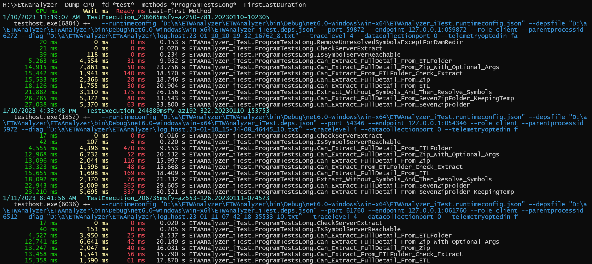

# Build Profiling

When running build and tests in the cloud your code may run suddenly slower due to a number of environmental reasons:

 - VM with a different CPU grade
 - Noisy neighbours which influence your performance 
 - Antivirus running in the cloud (Defender in Azure)
 
 When you track your build and test times (you do regression testing?) you want to see why the build/test runs slower 
 because of your own changes. How can you differentiate the environmental effects from your own changes?

 The answer is system wide profiling (for noisy neighbours you would need to profile the VM Host also). When you use
 in your github actions as host windows-latest

```
 jobs:
    build:
        runs-on: windows-latest
```

 you get the current Windows Server edition in a VM with some tools added. Since Windows 10 the Windows Performance Recorder wpr.exe
 is part of Windows. You already have everything to track things!

 At the bottom is a sample gitub action [BuildProfiling_Example.yml](https://github.com/Siemens-Healthineers/ETWAnalyzer/blob/main/.github/workflows/BuildProfiling_Example.yml) you can integrate into your 
 build to record system wide profiling data for any action
 you are interested in. It will download a custom wpr profile to record less data than the default profiles, start a
 timer to measure how long the action did take and it will stop profiling.
 The main issue with ETW is that it generates GB of data per minute. But with ETWAnalyzer we can extract profiling data
 into small json files which are up to 100 times (depends on what you extract) smaller. The Github workers have no access to MS Symbol servers which 
 makes symbol lookup more complicated. But since ETWAnalyzer 2.5.4.0 symbol lookup for unresolved methods from Json files
 is also supported.

 ## Data Analysis

 

 You can download from several builds the small json data and since the file name has the duration encoded it is straightforward
 to create a nice graph with any tool you like.

 

 With ETWAnalyzer it is easy to plot CPU, Memory and many other system wide properties with a one liner, or export
 the data into a CSV file by adding -csv stats.csv to any ETWAnalyzer command line.
  ```
 Etwanalyzer -dump stats -Properties CPUName,CPUSpeedMHz,MemorySizeMB
  ```
 

 Now it is easy to see e.g. the AV overhead of all test runs aggregated via WPA stacktags. Since Virus stacktags
 do not need resolved symbols this works even if we did not resolve method names. See 
 [How fast is your Virus Scanner](https://aloiskraus.wordpress.com/2022/03/22/how-fast-is-your-virus-scanner/) for more
 details. 
 The following command line prints the top process which did wait most of the time for AV and shows it only as file total.
 You can use for  ```-ShowTotal Process``` (shows just process name and total at process level) and  ```Method``` (shows raw input data).
 ```
 Etwanalyzer -dump CPU -topN 1 -fd .  -stacktags *virus* -SortBy Wait -ShowTotal Total
 ```
 

 After a high level overview we can go down to method level after resolving all C/C++ methods which need a symbol
 server for resolution.

 ```
 Etwanalyzer -LoadSymbol -fd . -SymServer MS
 ```
 If you omit -symserver it will use the cached symbols already present on your machine which is much faster than 
 to look missing symbols always up at Microsoft. 

 


 Now you can query your tests at method level to find out how long they were running with a simple query
 ```
 Etwanalyzer -Dump CPU -fd *test* -methods *ProgramTestsLong* -FirstLastDuration
 ```
 

 The option -FirstLastDuration is useful to print the time when a method was seen last-first in the trace which is a good 
 estimate how long it did actually run. This is especially useful if some async method which is called during start and end of an
 async activity is traced which can be used to measure the async call duration. 

 ### ETWAnalyzer Options
 The many command line options in ETWAnalyzer are conceptionally part of 5 groups. When you dump soemthing you decide
 - What 
    - CPU
    - Disk
    - File
    - Exception
    - DNS,
    - ...
 - Apply Filters on Process, File, Method, Server level
    - -ProcessName (-pn), -Method, -StackTag, -FileName, ... 
 - Choose Display Time Format
     - ```-ProcessFmt``` , ```-TimeFmt``` are supported by all dump commands which show time data.
        - ```s or second```             Print as time in seconds since trace start. This is the time WPA is showing in the UI.
        - ```Local```                   Print time as local time on which the data was recorded. This is usually the time customers report when something did fail.
        - ```LocalTime```               Same as Local but without date string.
        - ```UTC```                     Print time in UTC (Universal Coordinated Time).
        - ```UTCTime```                 Same as UTC but without date string.
        - ```Here```                    Print time as local time in the current system time zone.
        - ```HereTime```                Same as Here but without date string.
 - Apply Sorting
    - ```-SortBy CPU/Wait/CPUWait/CPUWaitReady/StackDepth/First/Last/TestTime``` or in File mode ```Total/Process/File,``` ...
 - Add specific aggregations
    - E.g. ```-ShowTotal File``` will print totals per extracted ETL file

  The many options are necessary to apply the right filters for each printed column. Conceptionally it is easy but
  the many options might be looking confusing at first. 

## Example Github Build Workflow with Profiling and Data Extraction
  Below is the full Github Sample how you can add Profiling to your own Build:

 ```
 name: Build Profiling Example 

on:
  workflow_dispatch

jobs:

    build:

        runs-on: windows-latest  # For a list of available runner types, refer to
                                 # https://help.github.com/en/actions/reference/workflow-syntax-for-github-actions#jobsjob_idruns-on  
        steps:
       
        - name: Checkout
          uses: actions/checkout@v3
          with:
            fetch-depth: 0
            
               
        # Download custom wpr Profile
        - name: Download and patch custom recording profile
          run: |
                curl https://raw.githubusercontent.com/Alois-xx/FileWriter/master/MultiProfile.wprp > MultiProfile.wprp
                # We need to remove the Strict="true" attribute in profile because in Azure some CPU counters 
                # are already monitored and wpr will complain even if we do not use a CPU counter recording profile. This is a bug in wpr.
                $var=(Get-Content -path MultiProfile.wprp -Raw);
                $replaced=$var.Replace('Strict="true"','');
                Write-Host $replaced
                Set-Content -Value $replaced -Path MultiProfile.wprp

        - name: GetStartTime
          run: |
            $startTime = [System.Diagnostics.Stopwatch]::GetTimestamp()
            # store start time in environment which is the github way to share variables between steps
            "ProfilingStartTime=$startTime" >> $env:GITHUB_ENV
          shell: powershell
          
          # Start Profiling
        - name: Start Profiling 
          run: |
                # We record into a file to capture everything.
                # Since extraction of a large ETL needs many GB of memory we can run out of memory so it is best
                # to split longer parts like build and test into separate files which are extracted separately
                wpr -start MultiProfile.wprp!CSwitch -start MultiProfile.wprp!File -filemode
                
        # Download ETWAnalyzer Binary
        - name: Download ETWAnalyzer
          run: |
                curl.exe -L  https://github.com/Siemens-Healthineers/ETWAnalyzer/releases/latest/download/ETWAnalyzer2.5.4.0_Net48.zip --output Analyzer.zip
                Expand-Archive -Path Analyzer.zip -DestinationPath .

        - name: Stop Profiling And Extract
          run: |
            $stopTime = [System.Diagnostics.Stopwatch]::GetTimestamp()
            $startStr = ${{ env.ProfilingStartTime }}
            $startTime = [System.Int64]::Parse($startStr)
            $runtimeMs = [System.TimeSpan]::FromTicks($stopTime-$startTime).TotalMilliseconds.ToString("F0")
            $date = Get-Date -format "yyyyMMdd-HHmmss"
            # store runtime to generate named artifacts
             "TestRunTimeMs=$($runtimeMs)ms_$($date)" >> $env:GITHUB_ENV
             
            # construct file name in format which is understood by ETWAnalyzer to later filter by testcase, test duration, ....
            # In general it is wise to add the timing to the file name so it is easier to verify if you are looking at the fast or slow file ... 
            $fileName = "ProfilingData\Build_$($runtimeMs)ms$($env:ComputerName).$($date).etl"
            
            mkdir ProfilingData > $null
            mkdir Extract > $null
            
             # Stop Profiling and save ETL file. If you are running .NET (4.8 and before) code you need to remove -skipPdbGen to get native image pdbs 
             # If you want to upload the pdb you need to store also the xxx.etl.NGENPDB folder to be able to resolve symbols for legacy .NET Framework applications
             wpr -stop $fileName -skipPdbGen
             
            # Extracted Json files are put into a sub folder Extract by default. You can override it with -outdir 
            .\ETWAnalyzer -extract all -fd $fileName -outdir Extract
            
        - name: Upload Profiling Extract Data
          uses: actions/upload-artifact@v3
          with:
            name: ExtractedETL_${{ env.TestRunTimeMs }}
            path: Extract
            retention-days: 90

        - name: Upload Full Profiling Data
          uses: actions/upload-artifact@v3
          with:
            name: ProfilingETL_${{ env.TestRunTimeMs }}
            path: ProfilingData
            retention-days: 90
```
