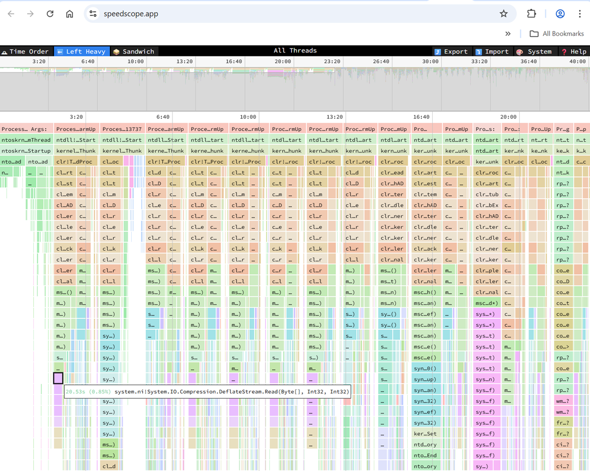

# -Convert
Convert the CPU sampling data of an ETL File a process to a [speedscope](https://www.speedscope.app/) json file. This was adapted
from [PerfView]( https://github.com/microsoft/perfview/blob/main/src/TraceEvent/Stacks/SpeedScopeStackSourceWriter.cs)  which contains the original code. 

Unlike the original code for PerfView it can generate flamegraphs for all threads in a process or even a system wide overview from all processes from all threads. 
This can be useful if the input data cannot be viewed with WPA due to time inversion or other recording issues. 

## Example

This will convert all processes and all threads into a speedscope file:
```
C>ETWAnalyzer -convert  -fd 15_18_01.13LongTrace.etl -pid -1             
Converting all processes system wide into one file.
Converted File: 15_18_01.13LongTrace_AllProcesses.speedscope
```

Time correlation is lost but it is good to check where most CPU is spent in total.

