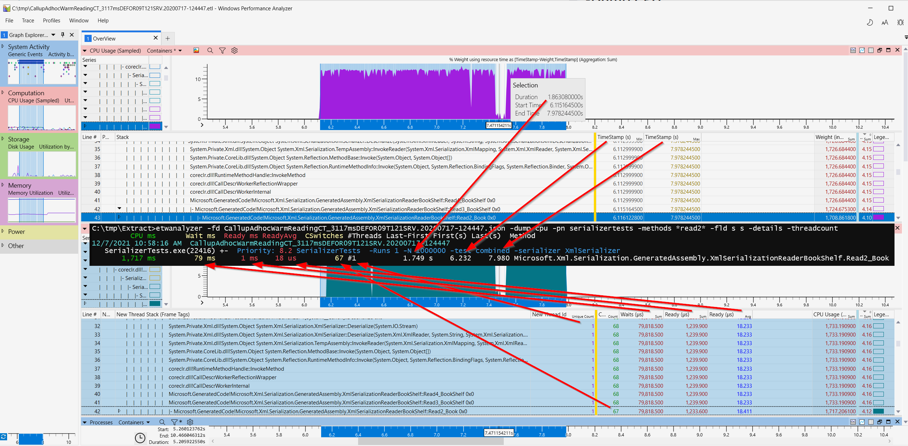
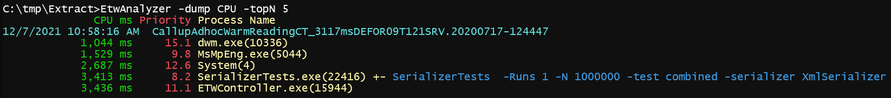
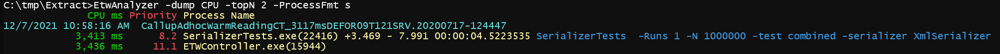
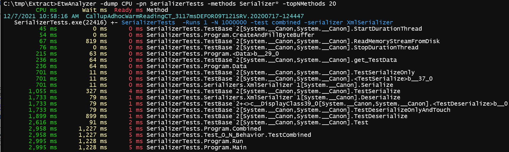
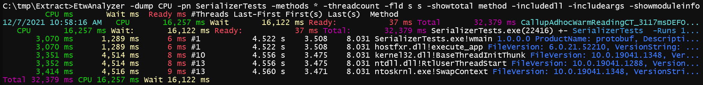
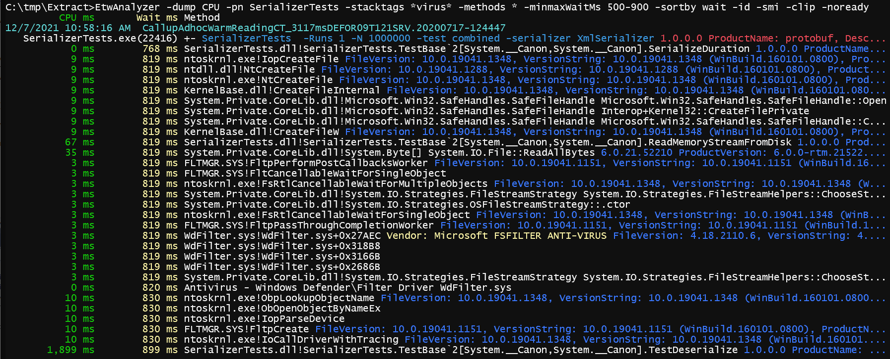

# -Dump CPU
Print CPU consumption of processes as total or by method. 

The data in the extracted JSON file is stored for all processes in method granularity. During extraction the default setting is to skip all 
methods with a *CPU/Wait Time < 10ms*. If you want to see all methods like you do in WPA you need to add *-allCPU* during extraction.

The picture below illustrates what data is stored per method for all processes of the ETL file without [extended](DumpCPUExtended.md)  data: 



The extracted data contains for each method in a process
- CPU usage from sampling data summed across all threads
- Wait time from Context Switch data summed across all threads where overlapping wait times are counted only once  
   - This is different in multithreaded applications what WPA shows!
- Ready time from Context Switch data summed accross all threads where overlapping ready times are counted only once
   - This is different in multithreaded applications what WPA shows!
- Average Ready time for all threads
- Number of threads this method was seen
- First time this method was seen on any thread (from Sampling and CSwitch events hence the small time difference).
- Last time this method was seen on any thread (from Sampling and CSwitch events hence the small time difference).
- Number of Context Switch events
- Average stack depth

To get an overview you would start with -dump CPU and a file name without further options in the extract folder which will print all files in the current folder. 
We can then dump the top 5 CPU consuming processes with the following command:
```
C:\tmp\Extract>EtwAnalyzer -dump CPU -topN 5
```


In this view also the average dynamic process priority is shown. The priority data is taken either from CPU sampling or Context Switch data. 
Dynamic priority means that this is not the priority you did set for your process/thread but the prority the OS did use after applying priority
boosts. The priority can be important to spot scheduling issues when CPU is low or when hybrid CPUs (Alder Lake+) on Windows 10 are used. 
On Windows 10 for Below Normal priority processes the work is scheduled almost 100% to the Efficicency Cores. 

Did you notice the +- after the process SerializerTests? These characters signal that the process was started + and has ended - during 
the recording. The other processes did run since trace start. You can print also the process start time instead of the +- signs to analyze 
startup/shutdown performance issues with the ```-ProcessFmt``` option:
```
C:\tmp\Extract>EtwAnalyzer -dump CPU -topN 2 -ProcessFmt s 
```


The +- signs are replaced by start/stop and duration for the process.
The blue part after the process name is its command line. If you are using custom color schemes in your shell you can add *-nocolor* to omit coloring output.
If you are experiencing word wrapping in your shell you can add *-clip* to prevent word wrapping while omitting the additional output which did clutter
your console. This is very useful to copy the output into an Email to show the issue a colleague.

Lets look inside the top 20 methods of SerializerTests
```
C:\tmp\Extract>EtwAnalyzer -dump CPU -pn SerializerTests -topNMethods 20
```


The dump command supports many additional options to add context data depending on what you are after:
```
C:\tmp\Extract>EtwAnalyzer -dump CPU -pn SerializerTests -methods * -threadcount -fld s s -showtotal method -includedll -includeargs -showmoduleinfo
```


The CPU consumption and wait time of a method in a process are summed over all threads. This is the main reason 
why the extracted Json data is so much smaller. For performance regression issues this data is in most cases sufficient
to track changes down to method level.

For each method the number of threads on which it was seen is recorded and can be added via the *-threadcount* option.

## First And Last Method Duration
With *-FirstLastDuration [timefmt] [timefmt]* or *-fld* you can display when a method was seen first and last in a trace file. 
See first picture how this relates to the data seen in WPA. For methods ETWAnalyzer keeps the aggregated data
across all threads. The First time is therefore the time a method was seen first on any thread. The method Last time
is the time a method was seen last in CPU sampling or Context Switch data. The difference Last-First is called FirstLastDuration.
If a method was executed in a process once on one thread it should closely match the method runtime. 
The same is true if a method was executed once on many threads e.g. DownloadAsync and it did produce data when it did start and finish you 
can get a good approximation how long the download was running. 

That aggregated data can give good insights, but you should be have checked in WPA if your assumptions about when this method is called
are true. The First/Last method timepoints are not useful when a method is called many times during the trace. E.g. a Render call 
will be called for many frames, but if the animation was paused in between then no render calls were made the FirstLastDuration would be misleading.
But if the method is called all the time it would simply be the time from trace start until trace end. Another source of error is if the method
is barely above your CPU sample rate (by default ETW samples with 1kHz = 1000 Samples/s). You can miss the First/Last method time and get 
unreasonable results. 

You can configure how the method First/Last time is printed. That allows you to correlate the
data gathered with ETW with log files to check if first invocation of a method e.g. DeleteDatabase relates with the errors seen in the 
logs shortly after the method was seen first in ETW. 

That query would be 

>*-Dump CPU -FirstLastDuration Local -method \*DeleteDataBase\**

The time format values are described in [-Dump Process](DumpProcessCommand.md).

## New Methods during Trace
When dealing with correlations it is often useful to find unique methods during a given time window.
Lets suppose we are dealing with a case of a sudden shutdown during application startup where the application itself consists of many processes. 
We know when the restart was triggered by looking at the CPU samples when *KubernetesWorker.StopAllProcesses (77.341 s)* was visible the first time. 
Since we do not know who was causing this we are interested in unique methods which are called shortly before the shutdown was initiated. 
With the query 

>*EtwAnalyzer -dump cpu -methods *service*;*Contoso* -MinMaxFirst 77.330 77.380 -TopNMethods 15 -fld s s*

we find all methods which are around 77.341 visible the first time (during the ETW Trace) in all processes on the system. The query -fld shows method
first and last time in WPA session time in seconds, but you can also use *utc*, or *local* time. This view cannot be 
achieved in WPA which will simply show all methods during a selected sample duration which makes it much harder to 
find methods which are showing up the first time in the interesting time region. 


By looking at time correlations we find that the managed process *Contoso.Common.Kubernetes.exe* did receive a *ServiceCommandCallback* callback which 
most likely was the service stop command for a .NET service process. 1ms before that we find a *DoStopService* for an unrelated service
named *ContosoConfiguration* in a powershell process. This was shutting down a different service but since the time correlation
is within 1ms it looks somehow related. A further investigation showed that the *Contoso.Common.Kubernetes.exe* service had configured a 
[service dependency](https://learn.microsoft.com/en-us/windows-server/administration/windows-commands/sc-config)
to the *ContosoConfiguration* service. Windows will shut down not only the Configuration service but also all dependent services.

Case solved. 

You might need a few iterations to record the right data to see all relevant methods by increasing the CPU sampling rate up to 8 kHz (= 0.125 ms), and/or 
enabling Context Switch profiling. That is usually sufficient to see nearly all relevant methods. 

## Stacktags

Additionally stacktag data which is supported by WPA in the form of a stacktag file is also extracted. During extraction the stacktag files
- Configuration/default.stacktags
- Configuration/Special.stacktags
are used.

Stacktags are a powerful way to gain insights into a system, because you can rename ("tag") specific methods and give them a descriptive name. 
If you group by Stack Tags in WPA you do not need to unfold the stack trace to the deepest methods just to find e.g. the virus scanner 
interfering again with your test. 


In the trace above we e.g. see that the Windows Defender stacktag is a few ms of CPU but in CPU Usage (Precise) which is the Context Switch data
view we see that we were blocked over 819ms summed across all threads. A nice property of stacktags is that they add up. The way this works 
can be explained how profiling works. Whenever a CPU sample interrupt is fired with 1000 sample interrupts/s for all running threads a stacktrace is
taken. If the process did fully utilize a CPU then we have got 1000 stack traces in 1s. If the process was blocked then we would get 0 stack 
traces. 

| Stack1      | Stack2      | Stack3     | Stack4      | Total CPU in ms   |
| ----------- | ----------- | -----------| ----------- | --------------    |
| Main()      | Main()      | Main()     | Main()      | 4  |
| F1()        | F1()        | F1()       | F1()        | 4 |
| A()         | A()         | B()        | B()         | 4|
| C()         | C()         | D()        | D()         | 4|
| F()         | F()         | |          | 2           |  |
| F2()        |             | |          | 1           |  |

Summation Stacktrace

| Level 0     | Level 1     | Level 3      | CPU in ms |
| ----------- | ----------- |  ----------- | --------- |
| Main()      |             |              | 4         |
| F1()        |             |              | 4         |
|             | ->A()       |              | 2         |
|             |  ->C()      |              | 2         |
|             | ->F()       |              | 2         |
|             | | ->F2()    | 1            |           
|             | ->B()       |              | 2         |
|             | ->D()       |              | 2         |

When you give method D a stacktag and method A then WPA assigns for the complete stack just one stacktag, where the deepest method 
stacktag wins. As a consequence you cannot count CPU twice when multiple stacktags compete for a given stacktrace.
This is a big advantage when summing up stacktags. We get always meaningful total numbers and never count things twice as it is the 
case with normal methods, because we store only method inclusive CPU and Wait times. 

We can with properly declared stacktags nicely tell how much impact the Virus scanner had on our test case


We find that our SerializerTest.exe was blocked 820 ms by Windows Defender. 
Because we know that this test runs single threaded we have therefore a true test 
slowdown and we can trust this number. 

To identify the region where Defender did intercept our calls we can use WPA, or we can interleave method names and Stacktags in one common output. 
```
EtwAnalyzer -dump CPU -pn SerializerTests -stacktags *virus* -methods * -minmaxWaitMs 500-900 -SortBy wait
```


We dump all methods which have a wait time between 500-900ms, then we sort by wait time ascending. 
By comparing the numbers it looks like the CreateFile calls are scanned by Defender which is contributing
to the pretty high wait times in the CreateFile method calls. Microsoft does not supply pdbs to Windows Defender,
but there is a list of pretty much all Filter Driver altitudes published by Microsoft which is a collection
of the Who’s Who of AV device drivers. ETWAnalyzer can use that to our advantage and print module infos for well known
driver names:
```
EtwAnalyzer -dump CPU -pn SerializerTests -stacktags *virus* -methods * -MinMaxWaitMs 500-900 -SortBy Wait -id -smi -clip -NoReady
```


WdFilter.sys is one the Windows Filter drivers used by Defender to intercept central operations such as process creation, file 
access and other things. The yellow string Microsoft FSFILTER... is from the well known list of AV vendors. This makes it much 
easier to measure the impact of AV solutions. 

