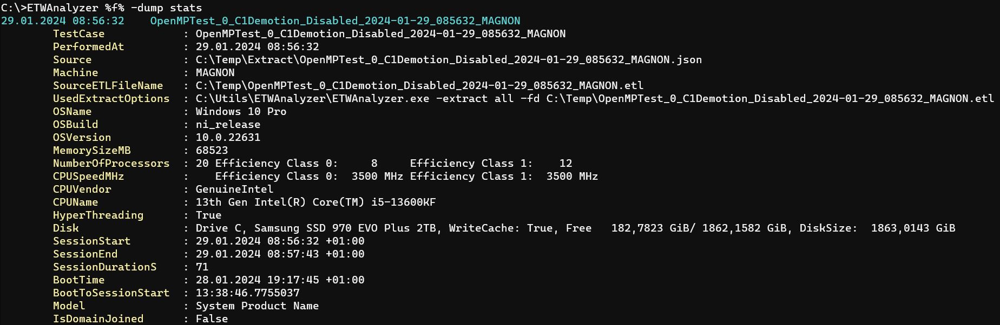
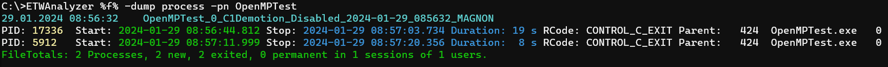
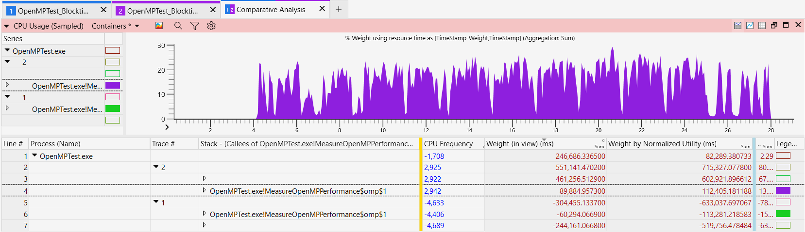

# Extended CPU Metrics

With the introduction of hybrid CPUs and dynamic frequency shifts from ca. 1 GHz up to 6 GHz performance has become a lot harder to measure and to compare. 
Internally Microsoft did add a lot of instrumentation but it is not documented how to make use of it. This is an attempt to shed more light on the topic which 
is the result of many experiments.

ETW can not only record CPU sampling and Context Switch events but also (in not virtualized environments) CPU Frequency, Temperature, CPU Topology and Power profile
settings. 

## Recording Data
[ETWController](https://github.com/Alois-xx/etwcontroller) brings in a custom and commented wpr profile [MultiProfile.wprp](https://github.com/Alois-xx/etwcontroller/blob/master/ETWController/ETW/MultiProfile.wprp) profile which can enable all necessary providers. 
To go to full speed download the profile
```
curl https://raw.githubusercontent.com/Alois-xx/etwcontroller/master/ETWController/ETW/MultiProfile.wprp > %temp%\MultiProfile.wprp
# Replace in .wprp file Strict="true" to nothing to make recording of wpr data possible
# even when some CPU counter recording is already running
# This looks to be some bug of WPR which bails out even if you do not intend to record any CPU counters
wpr -start %temp%\MultiProfile.wprp!CSwitch -start %temp%\MultiProfile.wprp!Frequency -start %temp%\MultiProfile.wprp!Network
wpr -stop %temp%\FirstLight.etl 
```
## Extracting Data
By default extended CPU metrics is captured. If you add during extraction ```-NoReady``` you can prevent the generation of extended ready metrics data. When CPU Frequency data
was recorded it is always extracted with the CPU extractor. To get everything use
```
C>EtwAnalyzer -extract all -fd %temp%\FirstLight.etl -SymServer ms 
1 - files found to extract.
Success Extraction of C:\Users\kraualaz\AppData\Local\Temp\Extract\FirstLight.json
Extracted 1/1 - Failed 0 files.
Extracted: 1 files in 00 00:04:37, Failed Files 0
```
After extraction you can go to the Extract folder or you can define a variable ```set f=-fd C:\Users\kraualaz\AppData\Local\Temp\Extract\FirstLight.json```
which is expanded in your shell so you have a short command line. You can combine as many ```-fd``` clauses as you like. It can be folder of extracted files, or you
filter by substrings like ```-fd C:\...\*fast*.json -fd c:\....\*slow*.json```.

## Dumping Extended Data


When you have a hybrid CPU and captured CPU topology data then you get also more details about how many CPUs of each core type you have and what the base frequency for each core type is.
```
ETWAnalyzer %f% -dump stats
```



To dump extended CPU data add ```-Details``` to ```-Dump CPU```. Depending on what is recorded (Frequency, context switch data) more or less data is displayed. 
Since the output is multiple lines per method it is usually best to limit it to a few lines. To reduce the amount of data you can use  ```-NoFrequency ``` to omit frequency data, 
```-NoPriority ``` to omit the process priority besides the executable name and ```-NoReady ``` to omit ready and extended ready data. 

```
C:\Builds\ETWAnalyzer\ETWAnalyzer>Etwanalyzer -fd %temp%\Extract\FirstLight.json -dump cpu  -topn 1  -topnmethods 1 -details 
```
Below is an example of a real case where for two processes the runtime differs by over a factor 6. Because of the large speed difference only partial recordings were done.
The Duration field which is the time the method was seen last-first time during the trace cannot be used to compare performance. 


Windows differentiates P (Power) and E (Efficiency) Cores by an Efficiency Class number which is returned by [GetSystemCpuSetInformation](https://learn.microsoft.com/en-us/windows/win32/procthread/getsystemcpusetinformation) where the 
SYSTEM_CPU_SET_INFORMATION structure contains the byte field EfficiencyClass. The EfficiencyClass numbering starts at 0 which mark the most power efficient CPUs (usually E-Cores), and then continues with more power hungry
cores at efficiency class 1 (P-Cores) and so on. It is unclear if with this numbering scheme P cores get an always changing number if more than two efficiency core types exist in one CPU. 

ETWAnalyzer prints the CPU consumption per core type and average frequency. It also prints the CPU affinity of
the executing threads. That is a best effort because when one pins threads to specific cores no ETW event is generated (to my knowledge). The affinity is determined only during start or stop of an ETW recording for
still running threads which might be helpful but do not interpret too much into that one. 

Besides frequency and core type also the CPU sleep state plays an important role for performance. A  [Context Switch event](https://learn.microsoft.com/en-us/windows/win32/etw/cswitch) contains a 
```PreviousCState``` field which tells you when the CPU was in a hardware enabled deep sleep state when it is 1. In WPA it is the column *Prev CState* by which you can group when analyzing CPU Usage (Precise) data. 
The processor can be powered down completely (including caches) when reaching [C6 state](https://web.stanford.edu/class/ee380/Abstracts/200205-slides.pdf) 
(see page 36 from Richard L. Sites for more details where Google has found bad performance in their clusters) which is associated with a wakeup cost of up to 100 us or more depending on the CPU type.

Since hardware sleep states are so impactful to performance ETWAnalyzer collects this in an extra metric named ```CPU Wakeup Ready``` times which contains the Ready percentiles and total sum of all context switch events where a free 
CPU (Idle process was owning the CPU) is waking up from a potentially hardware enabled deep sleep state. 
If you look at picture in the first process (OpenMPTest 17336) the 50% percentile (also known as median) is 66,9 us which is in line with the expected wakeup time from a deep C6 sleep state. 
You will find such high wakeup times mostly on server machines, where the C6 sleep state is enabled in the BIOS. On consumer machines you will see usually a much lower wakeup time of (see second process) e.g. 5.8 us.
The reason is that consumer machines have set a (Intel only) CPU flag to enable C1 Demotion which is telling the CPU to ignore deep sleep requests by the idle threads if the number of sleep requests per time frame is too high.

The other Ready times are all non idle ready times which can show cross process interference or thread ping pong inside one application. In our case by far most events were context switch events from blocking calls which were
also performed from deep sleep states but the previous owner of the CPU was OpenMPTest and not Idle which is the reason why it shows up under ```Other Ready```. 

The second OpenMPTest run did have a much lower ```CPU Wakeup Ready``` time because the CPU Feature flags C1 Demotion was enabled resulting in much less C6 state transitions which results in higher power consumption but
lower latencies.


### Comparing CPU Data with different frequencies
When you record CPU data with frequency and you try to compare data you might have a hard time because of different CPU frequencies. For that ETWAnalyzer has the ```-Normalize``` flag which calculates the CPU consumption
normalized to the nominal (100%) frequency.
```
ETWAnalyzer %f% -dump cpu -topn 2 -topnmethods 1 -details  -normalize -noready 
```


In this case the test application did have the same frequency, it was just running not long enough because the process was interrupted with Ctrl-C which is visible
in the return code when you dump the processes: 
```
ETWAnalyzer %f% -dump process -pn OpenMPTest
```


WPA dynamically adds columns to CPU Usage (Sampled/Precise) when your record frequency data. 
The new WPA columns are 
 - CPU Frequency
	- You can plot frequency over time or average it in the table
 - CPU Frequency (in view)
	- In a table it will calculate only over the values which are currently visible
 - CPU Performance
	- % over/below nominal frequency
 - (%) Weight by Normalized Utility
	- Calculates CPU consumption to normalized 100% frequency (no boost)
 - (%) Weight by Utility
	- Same as Normalized Utiliy



In the table above you can e.g. find that the normalized CPU consumption in the ...$omp$1 method was idential (112 s vs 113 s) while the measured one (89 s vs 60 s) is quite different due to different
CPU frequency which was 2.9 GHz vs 4.7 GHz.

## Hybrid CPU Scheduling
Running workloads on hybrid CPUs is challenging when the workload is running not on the expected core type. ETWAnalyzer is one of the very few tools which makes
it easy to find out on which cores at which frequencies your workload was running. If you record the data with MultiProfile.wprp you get also the currently active
power profile settings dumped to ETW which can be used to compare different Windows power profiles with [-Dump Power](DumpPower.md).
To compare different power profiles you can run a simple CPU loop which runs for 10s on multiple threads. If you run e.g. 12 threads for 10s you 
consume by definition regardless of the CPU type 120s of CPU. If due to concurrency and OS madness your threads are piling up on the E or P cores 
only you would find CPU oversubscription issues when your overall CPU consumption was below 120s. That can be backed by 
extracting the data to a CSV file and process the data further e..g with Excel to find scheduling issues with different Windows Power profile settings by adding ```-csv issue.csv```
which all dump commands support.
