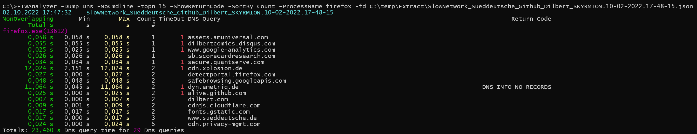

# -Dump Dns
Dump all DNS Client requests and their duration to console, or export selectd data to a CSV file. To get data
you need to record data with enabled *Microsoft-Windows-DNS-Client* ETW provider along with process and thread events.

## Example
To print the DNS requests of all chrome processes, sort not by query time (that is default) but by the number of DNS requests
you can use this command line

*ETWAnalyzer -Dump Dns -NoCmdline -ShowReturnCode  -SortBy Count -ProcessName chrome -fd DnsClient.json*




I have entered in chrome some invalid host name which leads to a DNS return code of DNS_ERROR_RCODE_NAME_ERROR (9003) which is a [Win32](https://learn.microsoft.com/en-us/windows/win32/debug/system-error-codes--9000-11999-) error code.

## Data Generation
To generate DNS ETW data you can use [MultiProfile.wprp](https://github.com/Alois-xx/FileWriter/blob/master/MultiProfile.wprp) which is a text file which you can download.

Start network recording type on an elevated command shell

- *wpr -start "C:\xxx\MultiProfile.wprp"!Network*

Execute your use case. It should not be longer than ca. 5 minutes, because data is recorded in a memory ring buffer which will overwrite the oldest events. 
If you need longer recording times you can modify the supplied profile and remove the TCP/IP traces by deleting the lines:
```
<EventProviderId Value="EventProvider_TCPProvider"/>
```

- *wpr -stop c:\temp\Network_DNS.etl*

## Extraction
Then you can extract DNS data with 
- *ETWAnalyzer -extract dns -fd c:\temp\Network_DNS.etl*

## Usage
Now you can query the data or export to CSV file with 

- *ETWAnalyzer -dump dns -fd c:\temp\Extract\Network_DNS.json* -csv DnsData.csv

## Usage
Dumping queries makes it much easier to find slow or failing DNS queries. A common source of issues are computers which are connected to several networks. 
If one local network has no internet connectivity, but the network interface has a lower interface metric DNS will first try the 
"dead" network and only after the first network query has timed out the second network with internet connectivity is used. To check if DNS queries via multiple 
network interfaces were done add *-ShowAdapter* to the command line of *ETWAnalyzer*. 