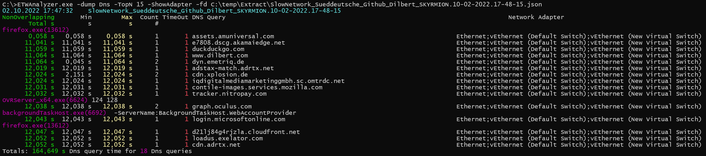

# -Dump Dns
Dump Dns client requests with duration to console, or export selected data to a CSV file. To get data
you need to record data with enabled *Microsoft-Windows-DNS-Client* ETW provider with process and thread events.

## Example
Print Dns requests of all firefox processes, sort not by query time (that is default) but by the number of DNS requests:

*ETWAnalyzer -Dump Dns -NoCmdline -TopN 15 -SortBy Count -ProcessName firefox -ShowReturnCode -fd C:\temp\Extract\SlowNetwork_Sueddeutsche_Github_Dilbert_SKYRMION.10-02-2022.17-48-15.json*


For an invalid host name a DNS return code of DNS_ERROR_RCODE_NAME_ERROR (9003) which is a [Win32](https://learn.microsoft.com/en-us/windows/win32/debug/system-error-codes--9000-11999-) error code is logged which indicates not resolvable or misspelled host name..

## Data Generation
To generate Dns ETW data you can use [MultiProfile.wprp](https://github.com/Alois-xx/FileWriter/blob/master/MultiProfile.wprp) which is a xml file which you can download to a local folder. 

Start network recording type on an elevated command shell

- *wpr -start "C:\DownloadFolder\MultiProfile.wprp"!Network*

Execute your use case. It should not be longer than ca. 5 minutes, because data is recorded in a memory ring buffer which will overwrite the oldest events. 
If you need longer recording times you can modify the supplied profile and remove the TCP/IP traces by deleting the lines:
```
<EventProviderId Value="EventProvider_TCPProvider"/>
```
To stop call wpr -stop with the output file name.
- *wpr -stop c:\temp\Network_DNS.etl*

## Extraction
Now you can extract Dns data with *-extract Dns* or *-extract All* if you wan to to see everything.
- *ETWAnalyzer -extract Dns -fd c:\temp\Network_DNS.etl*

## Usage
Now you can query the data or export to CSV file with 

- *ETWAnalyzer -dump Dns -fd c:\temp\Extract\Network_DNS.json* -csv DnsData.csv

## Usage
Dumping Dns queries makes it much easier to find slow or failing DNS requests. A common source of issues are computers which are connected to several networks. 
If one local network has no internet connectivity, but the network interface has a lower interface metric Dns will first try the 
"dead" network and only after the first network query has timed out the second network with internet connectivity is used. To check if DNS queries via multiple 
network interfaces were done add *-ShowAdapter* to the command line of *ETWAnalyzer*. 

*ETWAnalyzer.exe -dump Dns -TopN 15 -ShowAdapter -fd C:\temp\Extract\SlowNetwork_Sueddeutsche_Github_Dilbert_SKYRMION.10-02-2022.17-48-15.json*



This query shows the 15 slowest dns queries which were first tried on a network which did have no route (Ethernet) to the destination address which did lead
to long (11-12s) queries. The first column *NonOverlapping Total s* shows the sum of all DNS queries where parallel overlapping query durations are
counted only once. This is the time the user experiences as delay waiting for the browser to display data where nothing happens. Depending on
the usage of [dnsapi.dll!DnsQueryEx](https://learn.microsoft.com/en-us/windows/win32/api/windns/nf-windns-dnsqueryex) which support asynchronous operations
multiple queries for the same host might be in flight. The sum of all durations of async queries leads to much bigger delays as the user 
is  experiencing. It is therefore important to count overlapping async query durations only once. 