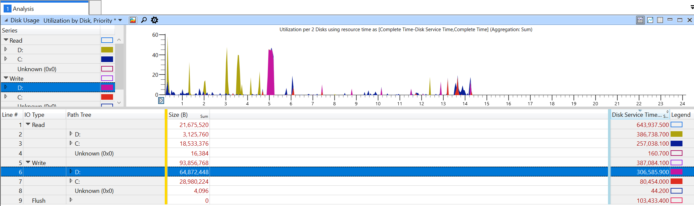
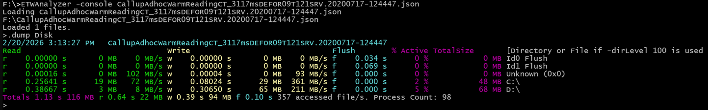

# -Dump Disk

Dump Disk IO metrics where the hard disk did actually some work. Unlike FileIO DiskIO normally contains much less data 
because if you read the same file again, the second time, the read will be served from the file system cache. If your
disk is some tiered storage like a SAN or a RAID then you still might get to see some cache effects due to e.g. RAID controller
cache effects.
DiskIO is not easy to attribute to a specific process, because many optimizations are in place. If you open a file and then read
a few KB the OS will prefetch data by doing some read ahead caching which can result that an application is not paying of the 
IO because it did parse the data so slow that the OS had plenty of time to prefetch data. See [this article of my old blog](https://web.archive.org/web/20141230191825/http://geekswithblogs.net/akraus1/archive/2014/12/14/160652.aspx).

ETWAnalyzer can show aggregates per directory which is configurable via -DirLevel, Read/Write throughput for one, or if *-Merge* is 
used a collection of files to check e.g. average throughput over an extended test run.

You can also get per file metrics by using *-DirLevel 100*. If the output does not suit your needs you can export the data
to a CSV file and analyze it further with Excel or R.

