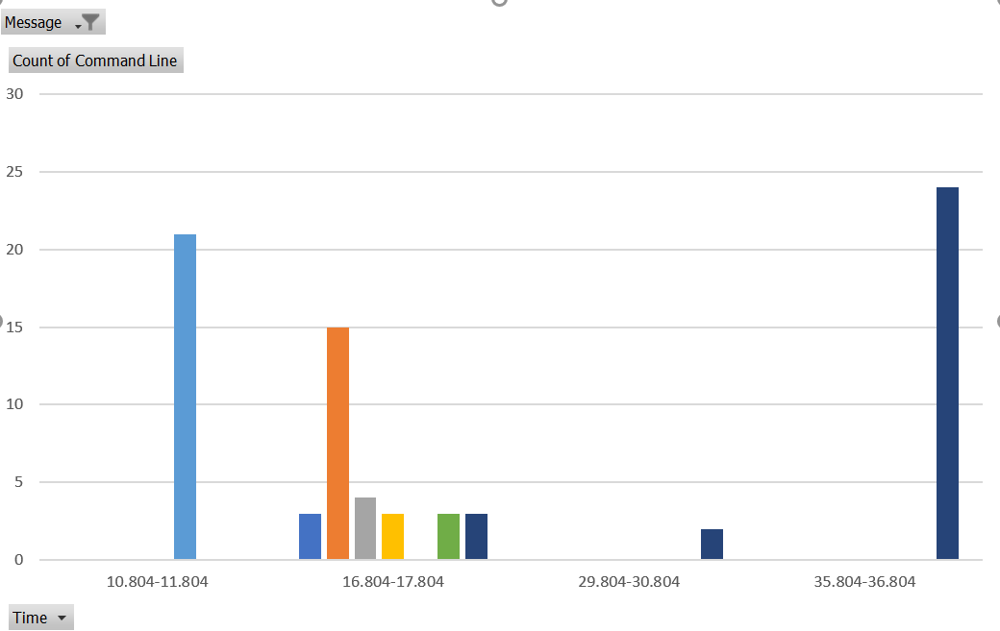

# -Dump Exception

Dump all thrown .NET Exceptions. The ETW Provider also logs all rethrows so you might see for a single exception multiple 
timepoints. Each rethrow, finally, and using blocks which also use a finally block will rethrow an exception.

Exceptions are filtered during extraction time with filters defined in the file Configuration/ExceptionFilters.xml.
If you do not want to apply the default filters use during extraction the option *-allExceptions*. 

<table class=MsoTableGrid border=1 cellspacing=0 cellpadding=0 width=1804
 style='width:1352.65pt;border-collapse:collapse;border:none'>
 <tr style='height:79.1pt'>
  <td width=1804 valign=top style='width:1352.65pt;border:solid windowtext 1.0pt;
  background:black;padding:0in 5.4pt 0in 5.4pt;height:79.1pt'>
  
C:\&gt;EtwAnalyzer -dump Exception -fd
  &quot;C:\Temp\Extract\CallupAdhocWarmReadingCT_3117msDEFOR09T121SRV.20200717-124447.json&quot; 
  CallupAdhocWarmReadingCT_3117msDEFOR09T121SRV.20200717-124447 
  SerializerTests.exe(22416)  +- SerializerTests  -Runs 1 -N 1000000 -test combined -serializer
  XmlSerializer 
          System.IO.FileNotFoundException 
                  1    Could not load file or assembly
  'notExistingToTriggerGACPrefetch, Version=1.0.0.0, Culture=neutral,
  PublicKeyToken=null'. The system cannot find the file specified.

  </td>
 </tr>
</table>

Exceptions are grouped by File/Process/Type/Message to get readable output. There are multiple options to filter by 
- Process ( *-ProcessName* )
- Process Command Line ( *-CmdLine* )
- Type ( *-Type* )
- Message ( *-Message* )
- Stacktrace ( *-StackFilter* )

See [Filters](Filters.md) for more information.

The exception stacktrace can be displayed after at least one filter was entered with the *-ShowStack* option.
Another useful option is the concept of zerotime to relate exceptions after a specifc method has been seen in the trace.

The following command will e.g. print exception time relative to the first ocurrence of the method ShowShutdownWindow and store
them in a CSV file. 

>EtwAnalyzer -dump exception -type *timeout* -timefmt s -zerotime first *ShowShutdownWindow* -csv Exceptions.csv -timefmt s

This allows you to generated e.g. a graph of all TimeoutException 

In this case we know that the default WCF (Windows Communication Foundation) close timeout is 10s. During the shutdown of connected WCF services we see
certain processes hang due to stuck WCF calls which resolve around 10s, 16s, 30s and 36s. As a next step one needs to
identify which processes are killed too early because other processes were still using them hindering a timely shutdown
of the whole system.
