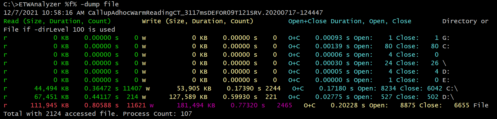
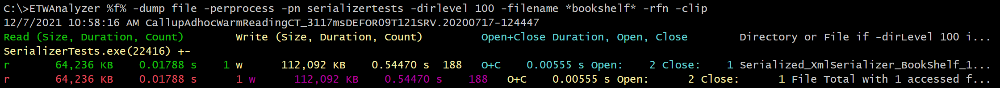

# -Dump File
Show all accessed files by a process, regardless if the read/write request was served by a cache. This corresponds from a user mode
point of view roughly to calls to 
- [CreateFile](https://docs.microsoft.com/en-us/windows/win32/api/fileapi/nf-fileapi-createfilea)
- [ReadFile](https://docs.microsoft.com/en-us/windows/win32/api/fileapi/nf-fileapi-readfile)
- [WriteFile](https://docs.microsoft.com/en-us/windows/win32/api/fileapi/nf-fileapi-writefile)
- [FindFirstFile](https://docs.microsoft.com/en-us/windows/win32/api/fileapi/nf-fileapi-findfirstfilew)
- [DeleteFile](https://docs.microsoft.com/en-us/windows/win32/api/fileapi/nf-fileapi-deletefilew)
- [SetSecurityInfo](https://docs.microsoft.com/en-us/windows/win32/api/aclapi/nf-aclapi-setsecurityinfo)
- [MoveFile](https://docs.microsoft.com/en-us/windows/win32/api/winbase/nf-winbase-movefilew)
- [CloseHandle](https://docs.microsoft.com/en-us/windows/win32/api/handleapi/nf-handleapi-closehandle)
 
which are done for file or directory objects. Network share files are also covered.

Details show more data such as the maximum file pointer which can help to estimate who big the file was, and the number of calls
to set file security attributes and file delete and rename operations. 

**Note: The FileIO duration can be hard to interpret if async/overlapped IO is used. The duration will then also include
the queuing time and not the actual disk IO duration.**

The data shown by WPA for the C:\ drive must match also with the extracted data:

At API level of TraceProcessing there are two sizes exposed. 
1. The buffer size passed to Read/WriteFile
2. The number of bytes returned by ReadFile or number of bytes of buffer written

ETWAnalyzer uses the passed buffer size to these APIs. That can help to find issues with too small buffer
sizes if performance issues are found. Reading from files with too small buffers is a common source of performance bottlenecks.

To see e.g. how many BookShelf files our SerializerTest did access we can use thefollowing query

To cope with limited console width *-rfn = -ReverseFileName* can be used to get most data into the limited console
window without word wrapping.
If during regression tests e.g. the read file size changes, or the number of accessed files,
or the file is read multiple times, this data will show what has changed. You can always
export the data into a CSV file to track things further in one or a collection of analyzed files.
For more options please refer to the command line help. 

