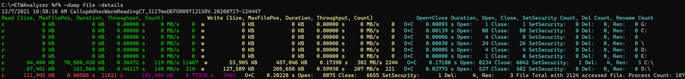

# -Dump File
Show all accessed files by a process, regardless if the read/write request was served by a cache. This corresponds from a user mode
point of view roughly to calls to 
- [CreateFile](https://docs.microsoft.com/en-us/windows/win32/api/fileapi/nf-fileapi-createfilea)
- [ReadFile](https://docs.microsoft.com/en-us/windows/win32/api/fileapi/nf-fileapi-readfile)
- [WriteFile](https://docs.microsoft.com/en-us/windows/win32/api/fileapi/nf-fileapi-writefile)
- [FindFirstFile](https://docs.microsoft.com/en-us/windows/win32/api/fileapi/nf-fileapi-findfirstfilew)
- [DeleteFile](https://docs.microsoft.com/en-us/windows/win32/api/fileapi/nf-fileapi-deletefilew)
- [SetSecurityInfo](https://docs.microsoft.com/en-us/windows/win32/api/aclapi/nf-aclapi-setsecurityinfo)
- [MoveFile](https://docs.microsoft.com/en-us/windows/win32/api/winbase/nf-winbase-movefilew)
- [CloseHandle](https://docs.microsoft.com/en-us/windows/win32/api/handleapi/nf-handleapi-closehandle)
 
which are done for file or directory objects. Network share files are also covered.

<table class=MsoNormalTable border=0 cellspacing=0 cellpadding=0 width=2081
 style='width:1560.95pt;border-collapse:collapse;mso-yfti-tbllook:1184;
 mso-padding-alt:0in 0in 0in 0in'>
 <tr style='mso-yfti-irow:0;mso-yfti-firstrow:yes;mso-yfti-lastrow:yes;
  height:28.7pt'>
  <td width=2081 valign=top style='width:1560.95pt;border:solid windowtext 1.0pt;
  background:black;padding:0in 5.4pt 0in 5.4pt;height:28.7pt'>
  
C:\&gt;ETWAnalyzer
  %f% -dump file 
  12/7/2021 10:58:16 AM
  CallupAdhocWarmReadingCT_3117msDEFOR09T121SRV.20200717-124447 
  Read
  (Size, Duration, Count)        Write
  (Size, Duration, Count)         Open+Close Duration, Open,
  Close        Directory
  or File if -dirLevel 100 is used 
  r            0 KB    0.00000 s    0 w            0 KB    0.00000 s    0  
  O+C    0.00093 s
  Open:    1 Close:    1 G: 
  r            0 KB    0.00000 s    0 w            0 KB    0.00000 s    0  
  O+C    0.00139 s
  Open:   80 Close:   80 C: 
  r            0 KB   
  0.00000 s    0 w            0 KB    0.00000 s    0  
  O+C    0.00006 s
  Open:    4 Close:    0 
  r            0 KB    0.00000 s    0 w            0 KB    0.00000 s    0  
  O+C    0.00030 s
  Open:   24 Close:   26 \ 
  r            0 KB    0.00000 s    0 w            0 KB    0.00000 s    0  
  O+C    0.00005 s
  Open:    4 Close:    4 D: 
  r            0 KB    0.00000 s    0 w            0 KB    0.00000 s    0  
  O+C    0.00000 s
  Open:    1 Close:    0 E: 
  r       44,494 KB    0.36472 s 11407 w       53,905 KB    0.17390 s 2244   O+C    0.17180 s Open: 8234 Close: 6042 C:\ 
  r       67,451 KB    0.44117 s 
  214 w      127,589
  KB    0.59930 s  221  
  O+C    0.02775 s
  Open:  527 Close:  502 D:\ 
  r      111,945 KB    0.80588 s 
  11621 w      181,494 KB    0.77320 s   2465  
  O+C    0.20228 s
  Open:   8875 Close:   6655 File Total with 2124
  accessed file. Process Count: 107

  </td>
 </tr>
</table>

Details show more data such as the maximum file pointer which can help to estimate who big the file was, and the number of calls
to set file security attributes and file delete and rename operations. 

**Note: The FileIO duration can be hard to interpret if async/overlapped IO is used. The duration will then also include
the queuing time and not the actual disk IO duration.**

The data shown by WPA for the C:\ drive must match also with the extracted data:

At API level of TraceProcessing there are two sizes exposed. 
1. The buffer size passed to Read/WriteFile
2. The number of bytes returned by ReadFile or number of bytes of buffer written

ETWAnalyzer uses the passed buffer size to these APIs. That can help to find issues with too small buffer
sizes if performance issues are found. Reading from files with too small buffers is a common source of performance bottlenecks.

To see e.g. how many BookShelf files our SerializerTest did access we can use the following query

<table class=MsoNormalTable border=0 cellspacing=0 cellpadding=0 width=2081
 style='width:1560.95pt;border-collapse:collapse;mso-yfti-tbllook:1184;
 mso-padding-alt:0in 0in 0in 0in'>
 <tr style='mso-yfti-irow:0;mso-yfti-firstrow:yes;mso-yfti-lastrow:yes;
  height:28.7pt'>
  <td width=2081 valign=top style='width:1560.95pt;border:solid windowtext 1.0pt;
  background:black;padding:0in 5.4pt 0in 5.4pt;height:28.7pt'>
  
C:\&gt;ETWAnalyzer
  %f% -dump file -perprocess -pn
  serializertests -dirlevel
  100 -filename *bookshelf* -rfn -clip 
  12/7/2021 10:58:16 AM
  CallupAdhocWarmReadingCT_3117msDEFOR09T121SRV.20200717-124447 
  Read
  (Size, Duration, Count)        Write
  (Size, Duration, Count)         Open+Close Duration, Open, Close        Directory or File if -dirLevel 100 i... 
  SerializerTests.exe(22416)
  +- 
  r       64,236 KB    0.01788 s    1 w      112,092 KB    0.54470 s 
  188   O+C   
  0.00555 s Open:    2 Close:    1 Serialized_XmlSerializer_BookShelf_1... 
  r       64,236 KB    0.01788 s      1 w      112,092 KB    0.54470 s    188  
  O+C    0.00555 s
  Open:      2 Close:      1 File Total with 1
  accessed f...

  </td>
 </tr>
</table>

To cope with limited console width *-rfn = -ReverseFileName* can be used to get most data into the limited console
window without word wrapping.
If during regression tests e.g. the read file size changes, or the number of accessed files,
or the file is read multiple times, this data will show what has changed. You can always
export the data into a CSV file to track things further in one or a collection of analyzed files.
For more options please refer to the command line help. 

