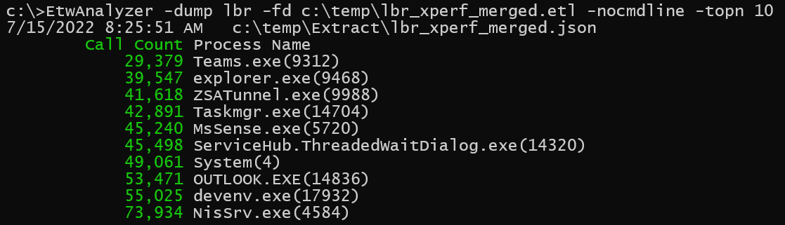
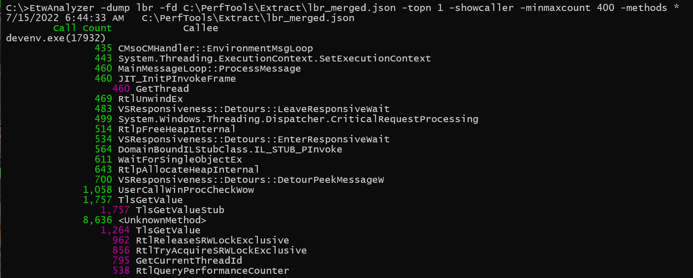

# -Dump LBR
ETW supports Last Branch Record Tracing which is a CPU tracing feature to record of a jump, call, ret or other
branching instruction the source and destination address of the branching instruction. ETWAnalyzer uses this 
data to estimate the number of methods calls (or more specifically the number of return calls back to a method) to identify 
hot methods which could need optmiziation. 

LBR data is useful to check if a method is seldom or many times called which is not visible in CPU sampling data. You can check if you have a high call count and you could try to optimize the number of method calls instead of optimizing the called method.

To enable LBR ETW tracing
the same preconditions apply as for [PMC](DumpPMCCommand.md)  traces.

The following branch filter options are present in the WPR schema:

| Name                   | Instructions            |
| --------------------   |  ---------------        |
| ConditionalBranches    | E.g. JNZ, JGE, ...      |
| NearRelativeCalls      | calll rip+xx            |
| NearIndirectCalls      | call xxx                |
| NearReturns            | ret                     |
| NearIndirectJumps      | jmp rip+xx              |
| FarBranches            | jmp rip+64BitAddress    |
| Kernel                 |  Ring 0 code            |
| User                   |   > Ring 0              |
| StackMode              | Not documented          |

ETWAnalyzer assumes that you filter away all branching types except NearReturns which are the return instructions.
We use this data to estimate how often a method has returned to another method which is the data ETWAnalyzer keeps track of
during extraction. The initial idea to sample all call instructions did not work with JIT compiled code because the
the call instruction points as target to a jmp instruction which is a memory region which is not part of any image. This 
has lead during experimentation to unresolved methods for all JIT compiled code. Before code is JITed the jmp points to
the JIT compiler call to compile the code which patches the jump after compilation to the compiled code. For C++ and
precompiled code things might work better. 

## Enable LBR ETW Tracing
There is support for LBR Tracing inside 

### Xperf Example
xperf has LBR tracing support via the -LastBranch flag of the -start command.

 >-LastBranch events filters   Dump Last Branch Record of the processor on
 >                                    specified events. Specify events as
 >                                    Event1+Event2+..EventN and filters as
 >                                    Filter1,Filter2...Supported filters are
 >                                    conditionalbranches, nearrelativecalls,
 >                                    nearindirectcalls, nearreturns,
 >                                    nearindirectjumps, farbranches, kernel, user
 >                                    and stackmode.


**Start Profiling**
>xperf -on CSWITCH+PROC_THREAD+LOADER+PROFILE -LastBranch PROFILE+CSWITCH conditionalbranches,nearrelativecalls,nearindirectcalls,nearindirectjumps,farbranches,kernel -f c:\temp\lbr_xperf.etl

**Stop Profiling**
>xperf -stop

>xperf -merge c:\temp\lbr_xperf.etl c:\temp\lbr_xperf_merged.etl

You need to merge the recorded data to add image identification events and generate NGEN pdbs to enable later tools to resolve symbols.

### Tracelog Example
Tracelog also has an option to enable LBR tracing. 
>-Lbr <EventName+EventName+...>:<Filter1,Filter2>
>                            Configure LBR tracing on kernel events.

**Start Profiling**
> tracelog.exe -start lbr -f lbr.etl -eflag CSWITCH+PROC_THREAD+LOADER+PROFILE -Lbr PROFILE+CSWITCH:conditionalbranches,nearrelativecalls,nearindirectcalls,nearindirectjumps,farbranches,kernel

**Stop Profiling**
> xperf -stop lbr

> xperf -merge lbr.etl lbr_merged.etl

You need to merge the recorded data to add image identification events and generate NGEN pdbs to enable later tools to resolve symbols.

### WPR Example 
Authoring WPR profiles is more complex. An example for a LBR profile is linked at [FileWriter](https://github.com/Alois-xx/FileWriter/blob/master/MultiProfile.wprp).
The relevant section is:
```
<HardwareCounter Id="HardwareCounters_EventCounters_LBR" Base="" Strict="true">
	<LastBranch>
		<Events>
			<Event Value="SampledProfile" />
			<Event Value="CSwitch" />
		</Events>
		<LastBranchFilters>
			<!--  LastBranchFilterOut Values: ConditionalBranches NearRelativeCalls NearIndirectCalls NearReturns NearIndirectJumps FarBranches Kernel User StackMode -->
			<LastBranchFilterOut Value="ConditionalBranches" />
			<LastBranchFilterOut Value="NearRelativeCalls" />
			<LastBranchFilterOut Value="NearIndirectCalls" />
			<!--
			<LastBranchFilterOut Value="NearReturns" />
			-->
			<LastBranchFilterOut Value="NearIndirectJumps" />
			<LastBranchFilterOut Value="FarBranches" />
			<LastBranchFilterOut Value="Kernel" />
		</LastBranchFilters>
	</LastBranch>
</HardwareCounter>
```
The option Strict="true" is useful to error out if for some reason LBR tracing could not be activated. Otherwise wpr will not complain
and silently swallow the error. This option can be problematic if you use a bigger recording profile with WPRUI in a Virtual machine, or a machine
where HyperV Features are enabled.

Upon start WPRUI will complain with 

>The number of hardware counters in the profile collection has exceeded the maximum allowable limit by the OS.

The only option to get the profile working, although LBR trace was not even tried to activate is to turn off strict mode.

**Start Profiling**

>wpr -start MultiProfile.wprp!LBR

**Stop Profiling**

>wpr -stop c:\temp\LBR.etl -skippdbgen

The option -skippdbgen can be used if you do not need stacks from precompiled (Ngenned) .NET Framework code. For .NET Core (or >= .NET 5.0) you 
can also use skippdbgen, because .NET Core does not use Ngen. This makes stopping the trace the first time a lot faster. The default of wpr and xperf 
is to generate for all loaded precompiled native images a synthetic PDB which is put besides the resulting ETL file in with a folder name xx.etl.NGENPDB.

## Extract Data
You can use either -extract PMC or All which will use all available extractors.

>EtwAnalyzer -extract all -fd c:\temp\lbr_xperf_merged.etl -symserver ms

```
1 - files found to extract.
Warning: No Memory Utilization snapshot data present in trace!
Warning: No Working Set snapshot data present in trace!
Success Extraction of c:\temp\Extract\lbr_xperf_merged.json
Extracted 1/1 - Failed 0 files.
Extracted: 1 files in 00 00:02:20, Failed Files 0
```


## Dump Examples

After extraction you can dump LBR data to get an overview who calls whom.
To get an overview per process you can call
> EtwAnalyzer -dump lbr -fd c:\temp\lbr_xperf_merged.etl -nocmdline -topn 10

to get an overview of the top 10 process with highest call counts. If you omit -nocmdline you get also the command line arguments which can be pretty long. 
You will want to add -clip to prevent wrapping of console output which works with all ETWAnalyzer console commands.



The command 
> EtwAnalyzer -dump lbr -fd C:\PerfTools\Extract\lbr_merged.json -topn 1 -showcaller -minmaxcount 400 -methods *

dumps from the extracted data the process with most calls which have a sample count > 400. Since LBR tracing
is sampling data the actual call counts are usually off by 1000-10000. The numbers between different traces should not 
be compared because if for some reason a method is slower the use case will get more CPU sample interrupts which will 
result in a "higher" call count value. Absolute numbers should be treated with care!



