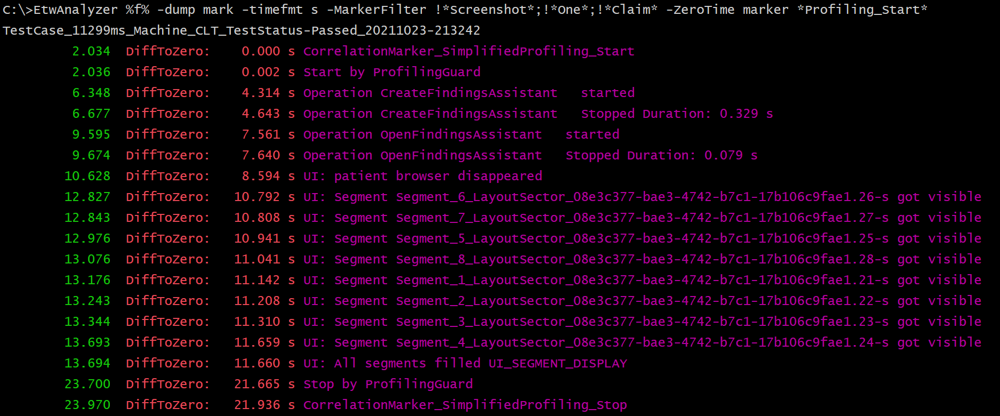

# -Dump Mark

WPA has an ETW Marker graph which is useful to navigate to central timeopints of an instrumented test case.
You can write your own marker events via the undocumented API [EtwSetMark](https://web.archive.org/web/20170921050719/http://geekswithblogs.net/akraus1/archive/2015/09/26/167117.aspx)
which needs a ETW Tracing session id (0 is the default kernel session of the NT Kernel Logger which is used by xperf) and the string.

You can also use in other -dump commands which support -ZeroTime one of these markers as zero timepoint to e.g. get all
method timings relative to the e.g. the Profiling_Start marker message which indicates the start of a profiling action.

To see all marker events relatvie to the start marker you can use this command

> EtwAnalyzer -dump mark -timefmt s -ZeroTime marker *Profiling_Start*

where %f% is an environment variable with *set f=-fd xxxx.json* to the actual Json file to shorten the command line.

