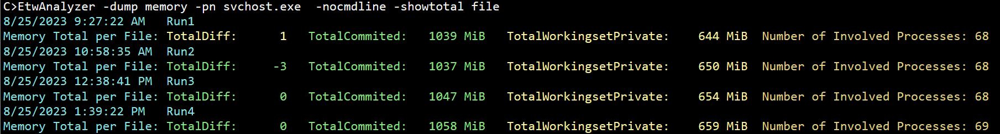

# -Dump Memory
Behind this switch two data sources are printed. One is the system wide memory consumption of the machine which is 
> ETWAnalyzer -dump Memory -TotalMemory

The second mode shows per process memory along with a diff from trace start until trace end to check for leaking processes. 
The main intention is to find leaking processes. Temporary processes which are quickly gone are not part of this metric. Only processes which are
still alive at the end of the trace are collected.

> ETWAnalyzer -dump Memory -topn 5 -clip

This command is mainly used to check if the machine was tight on memory, or if processes did leak memory during
long running tests. ETWAnalyzer can calculate the total memory growth of processes over a collection of
ETL files. 

## Displayed Data
 - Diff is the difference in committed memory from end-start.
 - Commit is the amount of allocated memory.
 - WorkingSet is the memory allocated in physical RAM which does also contain loaded dlls which are shared between processes. Summing up WorkingSet.
   values would lead to meaningless values and are hence not shown in the summary.
 - Shared Commit is basically the sum of all memory mapped files.
a process has access to. This includes all file mapping objects, and page file allocated memory file mappings.
The value remains large even if you have not mapped any file mapping objects. This is the size of all file
mapping objects the process has access to which are mostly created with a call to [CreateFileMapping](https://docs.microsoft.com/en-us/windows/win32/api/winbase/nf-winbase-createfilemappinga). If multiple processes have mapped the 
same file then each process gets the mapped file size as Shared Commit.
 - Workingset Private is only shown when *-Details* is added to the command line. It is the memory consumed on physical RAM chips which is not shared with other processes.

 # Useful Queries
 Dump for a list of extracted ETL files only the sum of committed memory by specific processes.

 >Etwanalyzer -dump Memory -pn svchost.exe  -ShowTotal File 

 

 To filter out leaking processes of a longer test run where multiple ETW files were recorded due to file size limitations of ETW
 you also filter out processes which were leaking more than e.g. 600 MB of memory over a collection of files. 
 
 >EtwAnalyzer -dump Memory -GlobalDiffMB 500 

 To export the data to a CSV file you can use

 >EtwAnalyzer -dump Memory -GlobalDiffMB 500 -csv LeakingProcesses.csv 

 # WPA View
 The displayed data from ETWAnalyzer can be visualized in WPA from the tables
 - Memory Utilization for the machine wide memory metrics (*-TotalMemory*)
 - Virtual Memory Snapshots for the per process memory metrics

