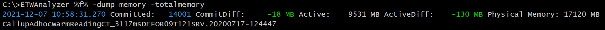
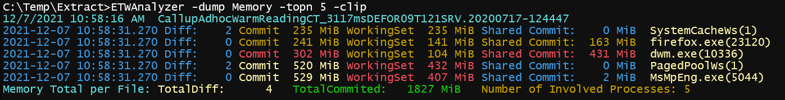
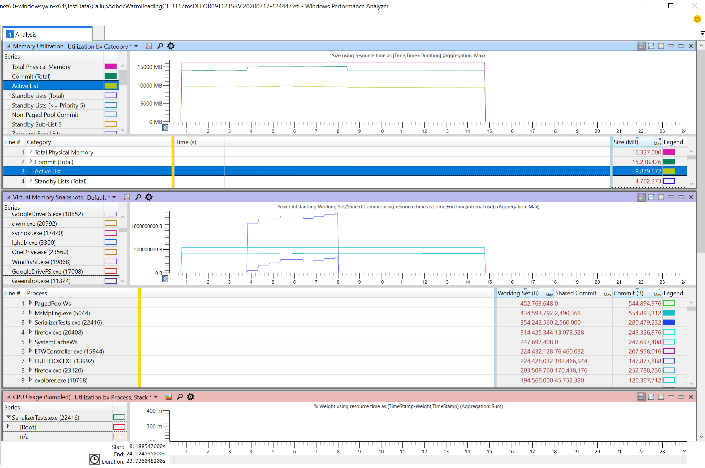

# -Dump Memory
- Show total machine memory diff from trace start until trace end. 

- Show per process memory diff from trace start until trace end.

This command is mainly used to check if the machine was tight on memory, or if processes did leak memory during
long running tests. ETWAnalyzer can calculate the total memory growth of processes over a collection of
ETL files. 

One little known memory type in ETW lingo is Shared Commit. This is basically the sum of all memory mapped files
a process has access to. This includes all file mapping objects, and page file allocated memory file mappings.
The value remains large even if you have not mapped any file mapping objects. This is the size of all file
mapping objects the process has access to which are mostly created with a call to [CreateFileMapping](https://docs.microsoft.com/en-us/windows/win32/api/winbase/nf-winbase-createfilemappinga). If multiple processes have mapped the 
same file then each process gets the mapped file size as Shared Commit.

