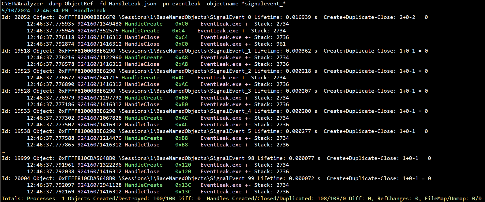

# -Dump ObjectRef
Dump handle information from ETW Handle tracing data. It can be used to track down handle leaks easily.
It can also display data from the Object manager where kernel objects are created,references are added and removed and objects are deleted. 
Additionally it can display File map/unmap operations. 


## Data Extraction
To extract data gathered from Handle, Object and File mapping events you need to use
>ETWAnalyzer -extract ObjectRef -fd ...etl -symserver MS 

or you can use ```All``` instead of ```ObjectRef``` which will include it. 

## Data Analysis
To dump all objects which were created by process EventLeak which are named objects which have the string signalevent_ in their name you can use:

>ETWAnalyzer -dump ObjectRef  %f% -pn EventLeak -objectname \*signalevent_\* 


This prints that 100 kernel objects were created and destroyed. That is expected since the loop did run from 0-99 to create the event handles. But for some
reason we have 108 Create handle calls which is disturbing because this means that some events were created more than one time which looks like some race condition. 

Before diving deeper lets explain what data is shown:

The Id is a unique number which can be used with ```-MinMaxId``` filter to select a specific object instance or a range of them. The kernel object pointer is printed, but 
this value can be reused so it is not always unique (can be filtered with ```-Object``` filter). After the kernel pointer the object name is printed, if present. Then the object
lifetime is printed or 9999s are used to mark objects which were never closed (can be filtered with ```-MinMaxDuration```).
Then the individual events grouped by type sorted by time are printed. Each line contains
    - Timestamp (can be switched to WPA time with ```-timefmt s```)
    - Process Id 
    - Thread Id
    - Event Name
    - Handle Value (can be filtered with ```-Handle``` filter)
    - Process Name (can be filtered for creating process with ```-processname or -pn``` for. To filter inside any event use ```-RelatedProcess```)
    - Stack id (```-ShowStack``` will print the stack to console, or write it to CSV file if output is exported via ```-csv``` option)


ETWAnalyzer has the option ```-Leak``` to dump all objects wich were created but have not been released when the trace was stopped. This will filter away all other object events which did not 
contribute to the leak.

This simple solution does not work because the leaking process has already exited and Windows will close all associated handles during process exit. That is the reason we find for all Handle create
calls also a matching close handle event. To find the leaks of short running processes we need to find all objects which were closed, when the process was terminating.
The final close call of all leaked handles is a call to NtTerminateProcess:
```
ExSweepHandleTable
ObKillProcess
PspRundownSingleProcess
PspExitThread
NtTerminateProcess
KiSystemServiceCopyEnd
```

We can filter for all leaked handles with the ```-DestroyStack``` option and select any e.g. NtTerminateProcess or ExSweepHandleTable as destructing stacks.
>ETWAnalyzer -dump objectref  -fd HandleLeak.json -pn eventleak -objectname \*signalevent_\* -destroystack \*NtTerminateProcess\*


Now we want to know where the leak is coming from 
>ETWAnalyzer -dump objectref  -fd HandleLeak.json -pn eventleak -objectname \*signalevent_\* -destroystack *NtTerminateProcess*  -ShowStack


This shows we should check EventManger::CreateEvent it its calling stack. We also know that leaked handles are created from multiple thread within ca. 10us which indicates
that we have a data race. That should make the analysis of handle leaks very straightforward. WPA is of course also a very good tool to track handle leaks, but some more advanced
analysis can be easier done with ETWAnalyzer.
When you are searching for all occurrences of event allocations done by a specific method you can use ```-CreateStack``` and to remove all events which are not matching a specific 
stack with ```-StackFilter```. These things are more complex to perform in WPA. 


### File Mapping Events

When you dump object data you can also exclusively dump file mapping events with ```-Map 1``` to only show file mapping events. 
```
Id: 49741 MappingObject: 0x6241B544000000 Lifetime: 0.000086 s
        16:08:05.671648  6288/10532 Map MsMpEng.exe 0x1B544000000-0x1B545000000 Size: 16777216 bytes, Offset: 0 Stack: 19457
        16:08:05.671734  6288/10532 Unmap MsMpEng.exe 0x1B544000000 Stack: 23891
```
The mapping object is combining the base address and the process id to get unique identifier which be used for filtering. 

### Object Traces
To show object reference traces you need to add ```-ShowRef``` to get additionally to handle traces every Reference change 
>ETWAnalyzer -dump objectref -Map 0 -ShowRef 
```
..
Id: 305 Object: 0xFFFF81002A8033C0 \Device\HarddiskVolume5 Lifetime: 0.000024 s  Create+Duplicate-Close: 1+0-1 = 0
        16:07:56.918279 60060/66436 HandleCreate    0x8000FD28 explorer.exe Stack: 2072
        16:07:56.918294 60060/66436 HandleClose     0x8000FD28 explorer.exe Stack: 2076
        16:07:56.918273 60060/66436 RefChange       explorer.exe 1 Stack: 2069
        16:07:56.918275 60060/66436 RefChange       explorer.exe 1 Stack: 2070
        16:07:56.918277 60060/66436 RefChange       explorer.exe -1 Stack: 1
        16:07:56.918277 60060/66436 RefChange       explorer.exe 1 Stack: 2071
        16:07:56.918283 60060/66436 RefChange       explorer.exe -1 Stack: 1
        16:07:56.918283 60060/66436 RefChange       explorer.exe 1 Stack: 2073
        16:07:56.918292 60060/66436 RefChange       explorer.exe 1 Stack: 2075
        16:07:56.918293 60060/66436 RefChange       explorer.exe -1 Stack: 1
        16:07:56.918294 60060/66436 Object Delete   explorer.exe ------------------------------- 2076
...
```

## Leak Example
Lets create a handle leaking application. This contains a data race in ```GetOrCreateEvent()``` which, when called from multiple threads, 
will leak one handle instance. The ```if (m_Event == nullptr)``` needs to be guarded by a lock construct or we have a data 
race where multiple threads see a null pointer and will initialize the handle value ```m_Event``` more than once. This are hard to spot errors if the event
is used by multiple processes and sometimes (potentially minutes later) the event is still existing in its signaled state
leading to wrong application responses. 

```
#include <iostream>
#include <thread>
#include <string>
#include <windows.h>
#include <chrono>
#include <atomic>
#include <vector>

std::string format_time()
{
    char date[256];
    auto now = std::chrono::system_clock::now();
    auto in_time_t = std::chrono::system_clock::to_time_t(now);

    std::strftime(date, sizeof(date), "%OH:%OM:%OS", std::gmtime(&in_time_t));
    return date;
}

void print(const char* str)
{
    std::cout << format_time() << " " << str << "\n";
}

void formatLine(const char* format, ...)
{
    va_list args;
    va_start(args, format);

    vprintf(format, args);

    va_end(args);
}

class EventManager
{
public:
    EventManager(int id)
    {
        m_Event = nullptr;
        m_Id = id;
    }

    HANDLE GetOrCreateEvent()
    {
        if (m_Event == nullptr)
        {
            m_Event = CreateEvent(m_Id);
        }

        return m_Event;
    }

    ~EventManager()
    {
        if (m_Event != nullptr)
        {
            BOOL lret = ::CloseHandle(m_Event);
            m_Event = nullptr;
        }
    }

private:
    HANDLE CreateEvent(int id)
    {
        std::wstring name(L"SignalEvent_");
        name += std::to_wstring(id);
        HANDLE lret = INVALID_HANDLE_VALUE;

        lret = ::CreateEvent(nullptr, TRUE, FALSE, name.c_str());

        if (lret == nullptr)
        {
            throw std::exception("CreateEvent did fail.");
        }

        return lret;
    }

private:

    HANDLE m_Event;
    int m_Id;
};


class EventConsumer
{
public:
    EventConsumer()
    {
    }

    void GetAndSignal(EventManager &mManager)
    {
        HANDLE hEvent = mManager.GetOrCreateEvent();
        ::SetEvent(hEvent);
    }
};

int main()
{
    print("Start");

    int Run = 0;

    for (int i = 0; i < 100; i++)
    {
        EventManager manager(i);
        auto lambda = [=, &manager]()
        {
            EventConsumer consumer;
            consumer.GetAndSignal(manager);
        };
        
        std::thread th1(lambda);
        std::thread th2(lambda);
        std::thread th3(lambda);
        std::thread th4(lambda);

        th1.join();
        th2.join();
        th3.join();
        th4.join();
    }

    return 0;
}
```


## Recording Data

See https://raw.githubusercontent.com/Alois-xx/etwcontroller/master/ETWController/ETW/MultiProfile.wprp for a complete wpr profile example.

You can start a combined recording for Handle, Object and File Mapping traces via
>wpr -start MultiProfile.wprp!Handle -start MultiProfile.wprp!HandleRef -start MultiProfile.wprp!FileMapping 

### Handle Leak Tracing
To enable handle tracing you need to add to your wpr recording profile the ```Handle``` kernel provider and enable the corresponding stacks
```
<SystemProvider Id="SystemProvider_Handle" Base="SystemProvider_Monitoring">
	<Keywords Operation="Add">
		<Keyword Value="Handle"/>
	</Keywords>
	<Stacks>
		<Stack Value="HandleCreate"/>
		<Stack Value="HandleClose"/>
		<Stack Value="HandleDuplicate"/>
	</Stacks>
</SystemProvider>
```
If you prefer xperf
>xperf -on PROC_THREAD+LOADER+OB_HANDLE -stackwalk HandleCreate+HandleClose+HandleDuplicate -f c:\temp\HandleLeak.etl
>xperf -stop 
>xperf -merge c:\temp\HandleLeak.etl c:\temp\HandleLeak_Merged.etl

This will enable handle tracing to track down potential handle leaks easily. But since handles are often created at a high frequency you might not 
be able to record for hours with handle tracing alone. There is an undocumented handle type filter in Windows which enables you to enable handle tracing for
tracing for a specific handle type. See https://github.com/Alois-xx/etwcontroller/releases/tag/2.5.2 for more information. 
Since stack traces are needing most space it can also help to tune the stack recording settings to e.g. just to take the stacks for the HandleCreate event and omit
the others which will give you another >factor two of time until the oldest events are overwritten if your are recording into an in-memory ring buffer.

### Object Reference Tracing
Handles are kernel objects which are reference counted. A kernel object will only be deleted when it is no longer referenced. When a handle
is used its reference count is increased. E.g. when you wait for an event via WaitForSingleObject it will before the wait is entered 
increase and then immediately decrease the object reference count to ensure that it is waiting on a valid handle. This information can be useful 
to track who accesses the object. 
Because of that this provider generates much more data than other heavy providers like Context Switch tracing. To make use of that provider even for 
short periods of time it is usually best to filter for specific object (handle) types (e.g. Events, Section (file mapping objects), ...).
When you enable the Object Reference provider you can also enable the Handle provider to get handle names out of the data which is not part of Object Reference data. 
The additional overhead of handle tracing is minimal. 
WPA cannot decode Object Reference Tracing data, while PerfView and ETWAnalyzer can.
```
<SystemProvider Id="SystemProvider_HandleRef" Base="SystemProvider_Monitoring">
	<Keywords Operation="Add">
		<Keyword Value="Object"/>
	</Keywords>
	<Stacks>
		<Stack Value="ObjectCreate"/>
		<Stack Value="ObjectDelete"/>
		<Stack Value="ObjectReference"/>
	</Stacks>
</SystemProvider>
```
>xperf -on PROC_THREAD+LOADER+OB_OBJECT -stackwalk ObjectCreate+ObjectDelete+ObjectReference+ObjectDeReference -f c:\temp\ObjectTrace.etl
>xperf -stop 
>xperf -merge c:\temp\ObjectTrace.etl c:\temp\ObjectTrace_Merged.etl


### File Mapping Tracing
Sometimes it is interesting to see who calls MapViewOfFile and UnmapViewOfFile. 
WPA cannot decode VAMap data, while PerfView and ETWAnalyzer can. 
```
<SystemProvider Id="SystemProvider_Mapping" Base="SystemProvider_Monitoring">
	<Keywords Operation="Add">
		<Keyword Value="VAMap" />
	</Keywords>
	<Stacks>
		<Stack Value="MapFile"/>
		<Stack Value="UnMapFile"/>
	</Stacks>
</SystemProvider>
```

>xperf -on PROC_THREAD+LOADER+VAMAP -stackwalk MapFile+UnMapFile -f c:\temp\FileMappingTrace.etl
>xperf -stop 
>xperf -merge c:\temp\FileMappingTrace.etl c:\temp\FileMappingTrace_Merged.etl
