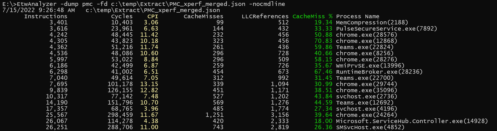

# -Dump PMC
Modern CPUs have Performance Monitoring Counters which can be used to identify CPU bottlenecks. Typical counters are
- Last Level Cache Reference
- Last Level Cache Miss
- Branch Prediction Success
- Branch Prediction Failure
- Number of executed instructions
- Cycles 

From these counters you can calculate
- Cache hit ratio
- Branch misprediction ratio
- CPI (Cycles/Instructions)
- Or IPC (Instructions/Cycles) which is the inverse to CPI

## Precondition
In order to enable PMC ETW tracing you must check if you have access to the hardware counters. The easiest way to check if is query the PMCSources via WPR:

> wpr -pmcsources

| Id  | Name                         | Interval | Min    |   Max       |
| ----| ---------------------------- | -------- | ------ | --------    |
|   0 | Timer                        |  10000   | 1221   |    1000000  |
|   2 | TotalIssues                  |  65536   | 4096   | 2147483647  |
|   6 | BranchInstructions           |  65536   | 4096   | 2147483647  |
|  10 | CacheMisses                  |  65536   | 4096   | 2147483647  |
|  11 | BranchMispredictions         |  65536   | 4096   | 2147483647  |
|  19 | TotalCycles                  |  65536   | 4096   | 2147483647  |
|  25 | UnhaltedCoreCycles           |  65536   | 4096   | 2147483647  |
|  26 | InstructionRetired           |  65536   | 4096   | 2147483647  |
|  27 | UnhaltedReferenceCycles      |  65536   | 4096   | 2147483647  |
|  28 | LLCReference                 |  65536   | 4096   | 2147483647  |
|  29 | LLCMisses                    |  65536   | 4096   | 2147483647  |
|  30 | BranchInstructionRetired     |  65536   | 4096   | 2147483647  |
|  31 | BranchMispredictsRetired     |  65536   | 4096   | 2147483647  |
|  32 | LbrInserts                   |  65536   | 4096   | 2147483647  |
|  33 | InstructionsRetiredFixed     |  65536   | 4096   | 2147483647  |
|  34 | UnhaltedCoreCyclesFixed      |  65536   | 4096   | 2147483647  |
|  35 | UnhaltedReferenceCyclesFixed |  65536   | 4096   | 2147483647  |
|  36 | TimerFixed                   |  10000   | 1221   |    1000000  |

If you get only one source named Timer you are either in a VM or you have enabled some HyperV Feature. You must uninstall all HyperV OS features to get access to the underlying harware counters.
VMWare ESXi has support for Virtual PMC (Enable virtualized CPU performance counters), but these are only available on Linux. Windows does not make use of Virtualized CPU performance counters.
Another source of issues is if you have VTune installed. The VTune driver vtss.sys interferes with CPU sampling profiling [during boot](https://community.intel.com/t5/Analyzers/Vtune-driver-vtss-sys-breaks-CPU-Sampling-with-ETW/m-p/1395568#M22325). It can also interfere in other ways. 
The safest thing is to uninstall VTune.

Microsoft has defined its own counter names which work also on non Intel/AMD CPUs (e.g. ARM)

| Generic Name         | Intel/AMD specific Name    |
| -----------          | -------------------------- |
| TotalIssues          | InstructionRetired		    |
| BranchInstructions   | BranchInstructionRetired   |
| CacheMisses          | LLCMisses                  |
| BranchMispredictions | BranchMispredictsRetired   |
| TotalCycles          | UnhaltedCoreCycles         |

## Enable PMC ETW Tracing
Intel CPUs support 3 PMC operation modes

- Event Counting
- Interrupt based sampling
- Processor event based sampling

ETW supports probably all of them, but the TraceProcessing library supports only parsing of data in Event Counting mode with Context Switch events.
Event Counting is the most simple form of PMC tracing where someone frequently reads the CPU counter values and stores them in an ETW event.
ETW allows to configure all kernel ETW events as trigger to read the current PMC counter values. 

Since we want to measure only our code it makes sense to use Context Switch events as natural choice to read the CPU counters whenever a thread with our code
is switched on/off to/from a CPU. This is still not exact, because in between interrupts and DPCs can be executed which are handling mostly hardware events.

### Xperf Example
xperf supports PMC counting events via the -PMC switch

```
-Pmc        counters events [strict] Dump hardware counters values with specified
                                     events. Specify counters as
                                     Counter1,Counter2,..CounterN and events as
                                     Event1+Event2+..EventN. Note that failures
                                     while programing the counters will not
                                     result in trace start failure, unless
                                     'strict' is specified.
```
**Start Profiling**
>xperf -on CSWITCH+PROC_THREAD+LOADER -Pmc LLCReference,LLCMisses,TotalIssues,TotalCycles CSWITCH strict -f c:\temp\PMC_xperf.etl

**Stop Profiling**
>xperf -stop

>xperf -merge c:\temp\PMC_xperf.etl c:\temp\PMC_xperf_merged.etl

You need to merge the recorded data to add image identification events and generate NGEN pdbs to enable later tools to resolve symbols.

### WPR Example
Authoring WPR profiles is more complex because if you want to combine other profiles which use CPU sampling you can enable just 3 PMC counters at once because
CPU sampling needs the Timer counter already.
Some example PMC profiles are located at [FileWriter](https://github.com/Alois-xx/FileWriter/blob/master/MultiProfile.wprp).
The relevant section is:
```
        <!-- Counting enabled CPI (Cycles per Instruction Graph) and Branch metrics -->
		<HardwareCounter Id="HardwareCounters_EventCounters_CPI_Branch" Base="" Strict="true">
			<Counters>
				<!-- Only up to 4 counters are supported at a time. If you use 4 then you cannot use CPU sampling because that uses Timer! -->
				<Counter Value="TotalCycles"/>
				<Counter Value="InstructionRetired" />
				<Counter Value="BranchMispredictions" />
				<!-- 
				<Counter Value="BranchInstructions" />
				-->

			</Counters>
			<Events>
				<Event Value="CSwitch"/>
				<!-- counter is called right after these events, should also be in SystemProvider -->
			</Events>
		</HardwareCounter>

		<!-- Counting enabled CPI (Cycles per Instruction Graph) and Last Level Cache (LLC) metrics -->
		<HardwareCounter Id="HardwareCounters_EventCounters_CPI_LLC" Base="" Strict="true">
			<Counters>
				<!-- Only up to 4 counters are supported at a time. If you use 4 then you cannot use CPU sampling because that uses Timer!-->
				<Counter Value="TotalCycles"/>
				<Counter Value="InstructionRetired" />
				<Counter Value="LLCMisses" />
				<!-- 
				<Counter Value="LLCReference" />
				-->
			</Counters>
			<Events>
				<Event Value="CSwitch"/>
				<!-- counter is called right after these events, should also be in SystemProvider -->
			</Events>
		</HardwareCounter>
```

See also the WPR example for [LBR](DumpLBRCommand.md) tracing for addtional information.

**Start Profiling**
>wpr -start c:\MultiProfile.wprp!PMCLLC

**Stop Profiling**
>wpr -stop c:\temp\PMCLLC_WPR.etl -skippdbgen
```
Press Ctrl+C to cancel the stop operation.
100%  [>>>>>>>>>>>>>>>>>>>>>>>>>>>>>>>>>>>>>>>>>>>>>>>>>>>>>>>>>>>>]
The trace was successfully saved.
```

## Extract Data
You can use either -extract PMC or All which will use all available extractors.

>EtwAnalyzer -extract all -fd c:\temp\PMC_xperf_merged.etl -symserver ms

```
1 - files found to extract.
Warning: No Memory Utilization snapshot data present in trace!
Warning: No Working Set snapshot data present in trace!
Success Extraction of c:\temp\Extract\PMC_xperf_merged.json
Extracted 1/1 - Failed 0 files.
Extracted: 1 files in 00 00:01:41, Failed Files 0
```

 
## CPU Metrics
The most basic metric is CPI. Lower is better. The theoretical limit is on most Intel CPUs 0.25 (most Intel CPUs have 4 execution units called ports) which allows
in the optimial case to execute up to 4 instructions in parallel. See [Intel Manual 19.1 Section ARCHITECTURAL PERFORMANCE-MONITORING EVENTS](https://www.intel.com/content/dam/www/public/us/en/documents/manuals/64-ia-32-architectures-software-developer-vol-3b-part-2-manual.pdf) for more information. 

From the 6 mentioned architectural counters you can enable only 4 at one time. If you are using CPU sampling then you can enable only 3 because CPU 
sampling uses the Timer PMC to fire a CPU sampling event. 

ETWAnalyzer can calculate the ratios and dump the enabled counters to console or a CSV file if the option -csv is used. 
>EtwAnalyzer -dump PMC -fd c:\temp\Extract\PMC_xperf_merged.json -nocmdline



WPA has some support for these but the numbers reported by the Windows 10 version of WPA for the process
are wrongly calculated. The Windows 11 WPA version uses a different table structure which is showing only the raw
counter numbers and you need to calculate the ratios on your own.

## Usage
If you have identified a CPU performance issue you should switch to more specialized tools to drill deeper. Using these counters is only the first step to check if you have a CPU efficiency issue.