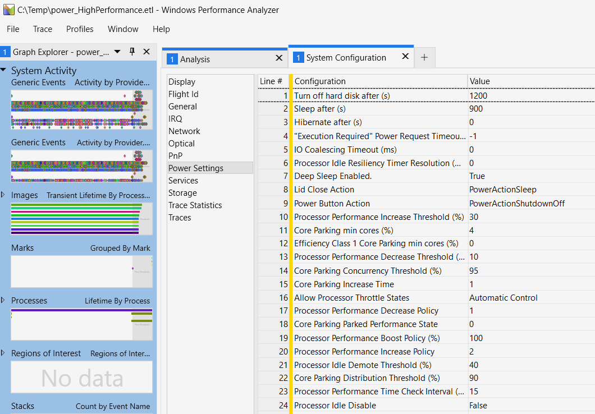
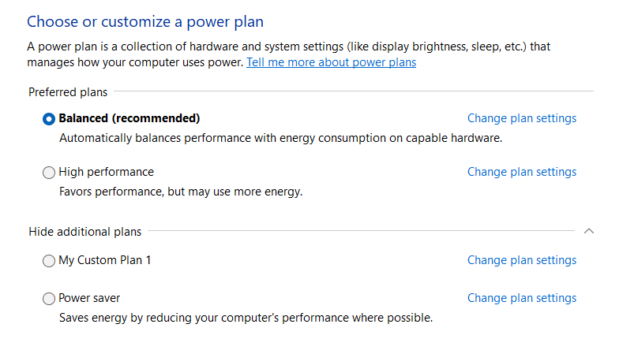

# -Dump Power
Windows supports multiple Power Profiles which you can employ to tune your machine towards performance or energy consumption.
ETWAnalyzer can display the currently active power plan settings with 
> ETWAnalyzer -dump Power -fd xx.json

Below are all CPU settings for the Balanced Power Plan printed:
```
ETWAnalyzer -dump power -fd c:\temp\Extract\power_Balanced.json 
File Date                               : 1/30/2024 10:44:46 PM                   
File Name                               : Balanced_Win11           

CPU Power Configuration

ActiveProfile                           : Balanced                                
Base Profile                            : Balanced                                
Autonomous Mode                         : True                                    
HeteroPolicyInEffect                    : 0                                       
HeteroPolicyThreadScheduling            : Automatic                               
HeteroPolicyThreadSchedulingShort       : Automatic                               
DecreaseLevelThreshold Class 1          : 25,25,25,25                             
DecreaseLevelThreshold Class 2          : 50,50,50,50                             
ShortVsLongThreadThreshold us           : 0                                       
LongRunningThreadsLowerArchitectureLimit: 0                                       
EnergyPreference %                      : 50                                      
EnergyPreference % Class 1              : 50                                      
BoostMode                               : Aggressive                              
BoostPolicy %                           : 60                                      
DecreasePolicy                          : Ideal                                   
DecreaseStabilizationInterval           : 1 ms                                    
DecreaseThreshold %                     : 20                                      
IncreasePolicy                          : Ideal                                   
IncreasePolicy Class 1                  : 3                                       
IncreaseStabilizationInterval           : 1 ms                                    
IncreaseThreshold %                     : 60                                      
IncreaseStabilizationIntervalClass1     : 1                                       
StabilizationInterval                   : 30 ms                                   
IncreaseThresholdPercentClass1          : 60,60,60,60                             
IncreaseThresholdPercentClass2          : 90,90,90,90                             
LatencySensitivity %                    : 99                                      
MaxFrequency MHz Class 0                : 0                                       
MaxFrequency MHz Class1                 : 0                                       
MaxThrottleFrequency %                  : 100                                     
MaxThrottleFrequency % Class 1          : 100                                     
MinThrottleFrequency %                  : 5                                       
MinThrottleFrequency Class 1 %          : 5                                       
SystemCoolingPolicy                     : Active                                  
ThrottlePolicy                          : Automatic                               
TimeWindowSize                          : 1           

Idle Configuration

DeepestIdleState                        : 0                                       
DemoteThreshold                         : 40                                      
Enabled                                 : True                                    
MinimumDurationBetweenChecks            : 50 ms                                   
PromoteThreshold %                      : 60                                      
ScalingEnabled                          : False     

Core Parking

ConcurrencyHeadroomThreshold %          : 50                                      
ConcurrencyThreshold %                  : 95                                      
MaxEfficiencyClass1UnparkedProcessor %  : 100                                     
MaxUnparkedProcessor %                  : 100                                     
MinParkedDuration                       : 1 ms                                    
MinUnparkedDuration                     : 3 ms                                    
MinUnparkedProcessor %                  : 4                                       
MinEfficiencyClass1UnparkedProcessor %  : 0                                       
OverUtilizationThreshold %              : 85                                      
ParkingPerformanceState                 : NoPreference                            
InitialPerformanceClass1 %              : 100                                     
SoftParkLatencyUs                       : 10 us                                   
ParkingPolicy                           : Ideal                                   
UnparkingPolicy                         : Ideal                                   
UtilityDistributionEnabled              : False                                   
UtilityDistributionThreshold %          : 90                       
```

ETWAnalyzer currently cares only about CPU settings to track down performance regression issues. It does not show Monitor, Hard Disk and related settings.
The data is there and can be viewed in WPA if you go to Trace - System Configuration - Power Settings



This are quite a few settings (37) but still only a fraction of all possible CPU Power settings (75) present on a current Windows 11 system (12/2023). 
TraceProcesssing does currently not parse all of them but we hope that will be fixed in a future version. 
The settings are part of three groups

- CPU Power Configuration
- Idle Configuration
- Core Parking

Some settings can be considered legacy if the CPU is in autonomous mode where the settings from Windows Processor Power Management are not considered and the 
CPU tunes itself without much help of the OS. Unfortunately it is not clearly documented which settings are relevant when the CPU (all modern CPUs since Skylake
support Speed Shift) is tuning itself in autonomous mode. 

Windows comes with 3 built in power profiles
- Power Saver
- Balanced
- High Performance


To see the currently active power profile you can record with wpr (part of Windows) the power settings
```
wpr -start Power
wpr -stop c:\temp\Power_1.json
```
If you switch between the three built in power profiles you will get after extraction 3 json files which you can easily query to find
where the differences in tuning are. 

ETWAnlayzer supports the ```-Diff``` flag for ```-Dump Power``` to show only the parameters which are different between the three power profiles:
```
ETWAnalyzer -dump Power -Diff  -fd c:\temp\Extract\power_Balanced.json -fd c:\temp\Extract\power_HighPerformance.json -fd c:\temp\Extract\power_PowerSaver.json 
Skipped 0 entries with identical power configurations.
File Date                               : 1/30/2024 10:44:46 PM                   1/30/2024 10:45:05 PM                   1/30/2024 10:45:46 PM                   
File Name                               : Balanced_Win11                          HighPerformance_Win11                   PowerSaver_Win11                        

CPU Power Configuration

ActiveProfile                           : Balanced                                HighPerformance                         PowerSaver                              
Base Profile                            : Balanced                                HighPerformance                         PowerSaver                              
Autonomous Mode                         : True                                    ...                                     False                                   
HeteroPolicyInEffect                    : 0                                       ...                                     4                                       
DecreaseLevelThreshold Class 1          : 25,25,25,25                             ...                                     50,50,50,50                             
EnergyPreference %                      : 50                                      0                                       60                                      
EnergyPreference % Class 1              : 50                                      0                                       60                                      
BoostPolicy %                           : 60                                      100                                     0                                       
DecreasePolicy                          : Ideal                                   Single                                  Rocket                                  
DecreaseThreshold %                     : 20                                      10                                      60                                      
IncreasePolicy                          : Ideal                                   Rocket                                  Single                                  
IncreaseStabilizationInterval           : 1 ms                                    ...                                     3 ms                                    
IncreaseThreshold %                     : 60                                      30                                      90                                      
IncreaseStabilizationIntervalClass1     : 1                                       ...                                     3                                       
StabilizationInterval                   : 30 ms                                   15 ms                                   200 ms                                  
IncreaseThresholdPercentClass1          : 60,60,60,60                             ...                                     90,90,90,90                             
LatencySensitivity %                    : 99                                      ...                                     0                                       
MaxThrottleFrequency % Class 1          : 100                                     ...                                     75                                      
MinThrottleFrequency %                  : 5                                       100                                     5                                       
MinThrottleFrequency Class 1 %          : 5                                       100                                     5                                       
SystemCoolingPolicy                     : Active                                  ...                                     Passive                                 

Idle Configuration

DemoteThreshold                         : 40                                      ...                                     20                                      
PromoteThreshold %                      : 60                                      ...                                     40                                      
ScalingEnabled                          : False                                   ...                                     True                                    

Core Parking

ConcurrencyHeadroomThreshold %          : 50                                      ...                                     20                                      
ConcurrencyThreshold %                  : 95                                      ...                                     97                                      
MinUnparkedDuration                     : 3 ms                                    ...                                     2 ms                                    
MinUnparkedProcessor %                  : 4                                       ...                                     100                                     
OverUtilizationThreshold %              : 85                                      60                                      90                                      
InitialPerformanceClass1 %              : 100                                     ...                                     50                                      
SoftParkLatencyUs                       : 10 us                                   1000 us                                 0 us            
```
You can add ```-Details``` to get help for each of the settings to give you an idea what the setting is all about. The output becomes then a bit messy
but very informative. One major aspect in the Power Saver profile is that MS turns off *Processor performance autonomous mode* to manually control the 
processor P-States which is one of the missing flags in TraceProcessing.  

```
ETWAnalyzer -dump Power -Diff -Details -fd c:\temp\Extract\power_Balanced.json -fd c:\temp\Extract\power_HighPerformance.json -fd c:\temp\Extract\power_PowerSaver.json  
File Date                               : 27.12.2023 01:36:38                     27.12.2023 01:36:59                     27.12.2023 01:37:20                     
File Name                               : power_Balanced                          power_HighPerformance                   power_PowerSaver                        
CPU Power Configuration
        Processor performance boost policy
        Specify how much processors may opportunistically increase frequency above maximum when allowed by current operating conditions.
        Range, Units:
          0 .. 100 %
        Subgroup / Setting GUIDs:
          54533251-82be-4824-96c1-47b60b740d00 / 45bcc044-d885-43e2-8605-ee0ec6e96b59
BoostPolicy %                           : 60                                      100                                     0                                       
        Processor performance decrease policy
        Specify the algorithm used to select a new performance state when the ideal performance state is lower than the current performance state.
        Possible values (index - hexadecimal or string value - friendly name - descr):
          0 - 00000000 - Ideal - Select the ideal processor performance state.
          1 - 00000001 - Single - Select the processor performance state one closer to ideal than the current processor performance state.
          2 - 00000002 - Rocket - Select the lowest speed/power processor performance state.
        Subgroup / Setting GUIDs:
          54533251-82be-4824-96c1-47b60b740d00 / 40fbefc7-2e9d-4d25-a185-0cfd8574bac6
DecreasePolicy                          : Ideal                                   Single                                  Rocket                                  
        Processor performance decrease threshold
        Specify the lower busy threshold that must be met before decreasing the processor's performance state (in percentage).
        Range, Units:
          0 .. 100 %
DecreaseThreshold %                     : 20                                      10                                      60         
...
```

## Not yet parsed power settings by TraceProcessing Library

With modern CPUs a lot of switches have been added which makes performance tuning challenging. TraceProcessing does currently
not surface the following CPU Power settings.

- A floor performance for Processor Power Efficiency Class 0 when there are Processor Power Efficiency Class 1 processors unparked
- Complex unpark policy
- Latency sensitivity hint min unparked cores/packages
- Latency sensitivity hint min unparked cores/packages for Processor Power Efficiency Class 1
- Latency sensitivity hint processor performance for Processor Power Efficiency Class 1
- Long running threads' processor architecture upper limit
- Module unpark policy
- Processor autonomous activity window
- Processor Duty Cycling
- Processor performance core parking parked performance state for Processor Power Efficiency Class 1
- Processor performance decrease policy for Processor Power Efficiency Class 1
- Processor performance decrease threshold for Processor Power Efficiency Class 1
- Processor performance decrease time for Processor Power Efficiency Class 1
- Processor performance decrease time for Processor Power Efficiency Class 1
- Processor performance history count for Processor Power Efficiency Class 1
- Processor performance increase threshold for Processor Power Efficiency Class 1
- Short running threads' processor architecture lower limit
- Short running threads' processor architecture upper limit
- Smt threads unpark policy
 
The following settings are parsed by ETWAnalyzer on its own because they are important and not surfaced by TraceProcessing

- Processor performance autonomous mode
- Heterogeneous thread scheduling policy
- Heterogeneous short running thread scheduling policy
- Heterogeneous policy in effect
- Active Profile Guid
- Base Profile Guid
- Initial performance for Processor Power Efficiency Class 1 when unparked
- Long running threads' processor architecture lower limit
- Minimum processor state for Processor Power Efficiency Class 1
- Processor energy performance preference policy
- Processor energy performance preference policy for Processor Power Efficiency Class 1
- Short vs. long running thread threshold
- Processor performance level decrease threshold for Processor Power Efficiency Class 1 processor count decrease
- Processor performance level decrease threshold for Processor Power Efficiency Class 2 processor count decrease
- Processor performance increase policy for Processor Power Efficiency Class 1
- Processor performance level increase threshold for Processor Power Efficiency Class 1 processor count increase
- Processor performance level increase threshold for Processor Power Efficiency Class 2 processor count increase
- Maximum processor state for Processor Power Efficiency Class 1
- Processor performance core parking soft park latency
- Processor performance increase time for Processor Power Efficiency Class 1

This list was extracted from a Windows 11 machine. The vigilant reader may have spotted Efficiency Class 2 settings which indicate that 
there can exist not only one E-Core type inside one CPU. With the release of Intel Meteor lake CPUs we have P/E and Lower Energy E Cores. 
It is still unclear if these have a different performance rating. In theory Lower Energy E cores should show up as cores with an Efficiency Level 0, 
then followed by the traditional E Cores with Level 1 and finally the P-Cores with Level 2. 

## Power Profile Testing
If you intend to test different power profiles the best tip for beginners is to know that you do NOT need to reboot when you switch to a different 
profile. The settings take immediate effect.



Most relevant settings are hidden and not accessible from the UI. There are other tools out there like PowerSettingsExplorer which makes comparing and 
testing Power Profile settings much easier to work with. 


## ETW Internals

To get Power settings data with xperf you need to execute a Capture State command for the Microsoft-Windows-Kernel-Power ETW provider to dump power settings
to ETW. This are just a few events and consume ca. 150 KB of data which is nothing. 

```
xperf -capturestate <YouUserModeSessionName> Microsoft-Windows-Kernel-Power 
```

You get then all power setting entries which are identified by a SettingGuid and its configured value as binary data. 

| Event Name | Id  | SettingGuid (Field 1) | DataSize (Field 2) | Data (Field 3) | Override (Field 4) |
| -----------| ----| ----------------------|--------------------|----------------|-------------------- |
| Microsoft-Windows-Kernel-Power/PowerSettingRundown/win:Info | 111 | 4d2b0152-7d5c-498b-88e2-34345392a2c5 | 0x00000004 | 00000004 0f 00 00 00 | False |
| Microsoft-Windows-Kernel-Power/PowerSettingRundown/win:Info | 111 | 4e4450b3-6179-4e91-b8f1-5bb9938f81a1 | 0x00000004 | 00000004 00 00 00 00 | False |

The SettingGuid is related to the Guids used by powercfg. We can query a specific power profile and then search for that
Guid to get an idea what the power profile setting is about:
```
powercfg  /q a1841308-3541-4fab-bc81-f71556f20b4a  | findstr /i 4d2b0152 
    Power Setting GUID: 4d2b0152-7d5c-498b-88e2-34345392a2c5  (Processor performance time check interval)
```

The same data is also part of the provider ```Microsoft-Windows-UserModePowerService``` which contains the group GUID to which 
subgroup this setting belongs to if you want to get an overview how many power settings exist. 

### Efficiency Classes
Windows groups cores into efficiency classes which is a byte value. If you have P/E cores then the 
E cores are 0 and the P Cores are 1. This scheme is extensible, but if you get in future e.g. two E-Core types
then the P-Cores will get Efficiency Class 2 which is a strange way to number things.

Below is the official Documentation from TraceProcessing Library:

>Processor power efficiency class describes the relative power efficiency of the
>associated processor. Lower efficiency class numbers are more efficient than
>higher ones (e.g. efficiency class 0 should be treated as more efficient than
>efficiency class 1). However, absolute values of this number have no meaning:
>2 isn't necessarily half as efficient as 1.

## Recording Data
The easiest way is to download [ETWController](https://github.com/Alois-xx/etwcontroller), select the Default profile, press Start and wait until the state turns green. Then press stop and extract the ETL file/s with ETWAnalyzer. All profiles from [Multiprofile.wprp](https://github.com/Alois-xx/etwcontroller/blob/master/ETWController/ETW/MultiProfile.wprp) record the currently selected power profile data. From the built-in wpr profiles only the *Power* profile will activate the right providers, which will also enable Frequency data recording.
```
C>EtwAnalyzer -extract all -fd C:\PowerProfiles  
3 - files found to extract.
Success Extraction of C:\PowerProfiles\Extract\Power_Balanced_Win11_2024-01-30_224446_MAGNON.json
Extracted 1/3 - Failed 0 files.
Success Extraction of C:\PowerProfiles\Extract\Power_HighPerformance_Win11_2024-01-30_224505_MAGNON.json
Extracted 2/3 - Failed 0 files.
Success Extraction of C:\PowerProfiles\Extract\Power_PowerSaver_Win11_2024-01-30_224546_MAGNON.json
Extracted 3/3 - Failed 0 files.
Extracted: 3 files in 00 00:00:04, Failed Files 0
```


