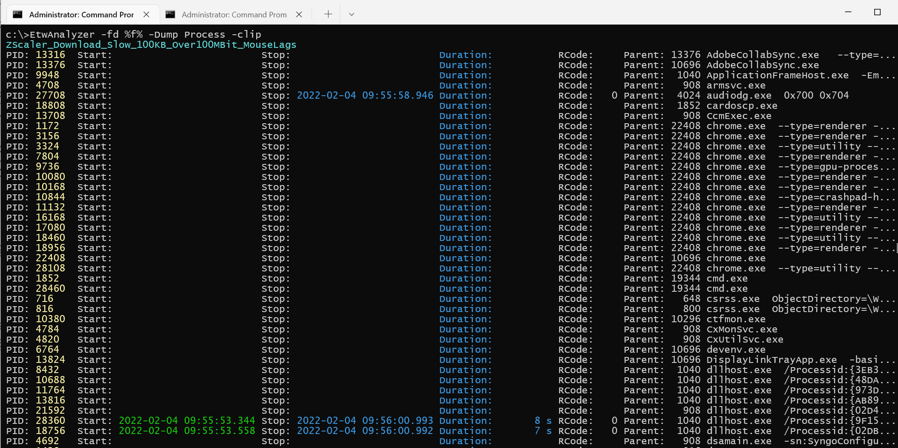
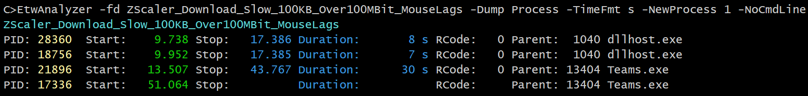
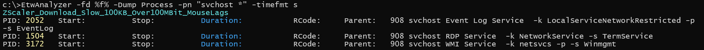
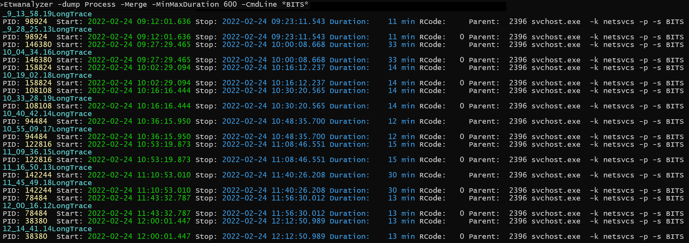

# -Dump Process
Print process names and command lines of all processes. Additionally the start/end times, return code and parent process id are printed.
This command works with ETL files and extracted Json files.


By default all processes with command line are printed. Processes are sorted by executable and process start 
time. This view is useful to quickly identify processes which are frequently started by e.g. a timer based event.



Start/stop times are printed in a fixed locale independent time format which defaults to the .NET format string "yyyy-MM-dd HH:mm:ss.fff".
ETWAnalyzer supports custom time formats for all commands which print time based values.
The common command line switch is -TimeFmt 

To print time in seconds since trace start to correlate with WPA time from the Windows Performance Analyzer you can use *-TimeFmt s*


## General options available in (nearly) all commands to ETWAnalyzer

The following options are common to other -dump commands where they can be used also, not only for -dump Process.

### Time Formatting
**-TimeFmt** formats time in custom ways. There are other options like *-ProcessFmt* which prints in other commands the start/stop times besides the process name, or *-FirstLastDuration* of -Dump CPU which supports the same enumeration values. The names
are consistent with the names WPA is using. In WPA you can configure every column which displays a time value to
- Time since trace start in seconds (Default)
- Local Time
- UTC

By default WPA will show time as time in seconds since trace start which is for ETWAnalyzer *-timefmt s*. 


Supported values for *-TimeFmt* are:

| -TimeFmt timefmt      | Description |
| ----------- | ----------- |
| s or second      | Print as time in seconds since trace start. This is the time WPA is showing in the UI.       |
| Local     | Print time as local time on which the data was recorded. This is usually the time customers report when something did fail.  
| LocalTime | Same as Local but without date string. |
| UTC|  Print time in UTC (Universal Coordinated Time).|
| UTCTime| Same as UTC but without date string. |
| Here|  Print time as local time in the current system time zone.|
| HereTime|  Same as Here but without date string. |

**Examples**

| -TimeFmt timefmt      | Description |
| ----------- | ----------- |
| s or second      | 51.064|
| Local     | 2022-02-04 09:56:34.670  
| LocalTime | 09:56:34.670 |
| UTC|  2022-02-04 08:56:34.670|
| UTCTime| 08:56:34.670|


## Process Selection/Filters

You can filter by process lifetime with *-NewProcess*. The supported values are:

| -NewProcess      | Description |
| ----------- | ----------- |
|    0   | All processes which have been running from trace start-end.   |
|    1   | Processes which have been started and potentially exited during the trace.   |
|    -1   |  Processes which have exited during the trace but have been potentially also started.  |
|    2   |  Processes which have been started but not stopped during the trace.  |
|    -2   |  Processes which are stopped but not started during the trace.  |
                                                     
The option *-ProcessName* can filter by process id or process name. *-ProcessName* can be abbreviated with *-pn*.
ETWAnalyzer has a general notation of filters. 

See [Filters](Filters.md) for more information. 


## Command Line Filters

The option *-CmdLine* filters for substrings of command line arguments to any process. To filter for e.g. all chrome instances which have -renderer in their command line would be 
> -CmdLine "\*--type=renderer\*" -ProcessName Chrome 

See [Filters](Filters.md) for more information.

## -PlainProcessNames

ETWAnalyzer is used at large scale software projects where many generic process names are present. The same is true on any Windows machine where you have 
a myriad of svchost.exe instances running different services. To make life easier ETWAnalyzer supports in the folder Configuration/ProcessRenameRules.xml
a xml file which is used to rename processes based on executable name and command line parameters.
Below is an example how a typical process rename file looks like:
```
<?xml version="1.0"?>
<ProcessRenamer xmlns:xsd="http://www.w3.org/2001/XMLSchema" xmlns:xsi="http://www.w3.org/2001/XMLSchema-instance">
  <ProcessRenamers>
    <RenameRule>
      <ExeName>svchost.exe</ExeName>
      <CmdLineSubstrings>
        <string>-s EventLog</string>
      </CmdLineSubstrings>
      <NewExeName>svchost Event Log Service</NewExeName>
    </RenameRule>
    <RenameRule>
      <ExeName>svchost.exe</ExeName>
      <CmdLineSubstrings>
        <string>-s TermService</string>
      </CmdLineSubstrings>
      <NewExeName>svchost RDP Service</NewExeName>
    </RenameRule>
    <RenameRule>
      <ExeName>svchost.exe</ExeName>
      <CmdLineSubstrings>
        <string>-s Winmgmt</string>
      </CmdLineSubstrings>
      <NewExeName>svchost WMI Service</NewExeName>
    </RenameRule>
  </ProcessRenamers>
</ProcessRenamer>
```
The end result is a renamed svhost process name which has a descriptive name. 


If you are for some reason confused or do not need this feature you can add *-PlainProcessNames* to disable automatic process renaming.

# -Dump Process Specific Command line options
##  -Crash
This option will check if any process in the ETW trace did crash. One way to detect crashed processes is to check if WerFault.exe was invoked for a process. Whenever a process crashes 
Windows error Reporting will be called back to create potentially a memory dump of the process. 
There is also another not widely known strategy. If a process dies due to an unhandled exception the Exception code is the return value of the crashed process which is 
a [NTStatus](https://www.osr.com/blog/2020/04/23/ntstatus-to-win32-error-code-mappings/) value. This value is similar to a Win32 error code but these
codes are used at the other side in the Kernel, although some mappings for most codes exist.
ETWAnalzyer employs both techniques to detect potentially crashed process and with unusual NTStatus return code.


Here we find that Job.exe did crash with a Heap corruption which did trigger no WerFault, because a custom error handler was installed. 
The process Test.exe did exit because with was terminated by the user via Ctrl-C. 

This option is most useful if you have some long term ETW Traces at hand to record a long running test for the complete session duration 
with lightweight profiling. A combination of file based traces where every 10 minutes a new file is started where process start/stop and 
10 ms CPU sampling is enabled along with Disk IO has proven to be a good compromise between the amount of data gathered and what issues one 
still can detect even if no Context Switch data or high CPU sampling data is present. 

## -SortBy
To change sorting by process names the following values are supported

| -SortBy      | Description |
| -----------  | ----------- |
|    Default   | Sort by process name and start time   |
|   Time       | Sort by process start/end time. It displays processes in 3 groups: Running, Ended, Started where the processes are sorted accordingly. |  

## -MinMaxDuration
Filter for processes with specific runtime range. The time is entered in seconds with your current locale dependent decimal point character.

## -Merge
This option can be used to calculate process lifetime over a collection of ETW trace files which did cover a longer test 
run where the data did not fit into one ETL file. The example below e.g. filters out all svchost processes which 
did run for longer than 10 minutes.
The process start/stop times in ETW files which is missing the start/stop event receives the values gathered by earlier or later ETW files
so one can see what the true run time was. 



## -ShowFileOnLine  
Do not print for each file the input ETL name, but print the source file name on each output line.
