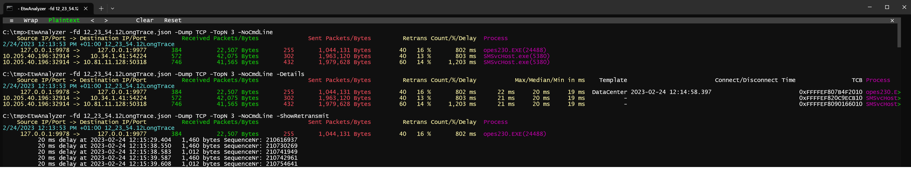

# -Dump Tcp

When you have recorded ETW data with *Microsoft-Windows-TCPIP* ETW provider you get with ETWAnalyzer after extraction with 

```
ETWAnalyzer -extract All -fd xx.etl or 
ETWAnalyzer -extract TCP xx.etl:
```

After extraction you can dump TCP connection data with 
```
ETWAnalyzer -console tcpTrace.json7z
.dump TCP -TopN 5
```

For each TCP connection the following data is extracted:
- **Connection**: Use ```-IpPort``` to filter for connections. As first value always the recording host IP and port is shown followed by remote destination and port. 
  IPv6 addresses which are wrapped IPv4 are shown in a non standard decimal format to make it easy to identify both addresses.
- **Connect/Disconnect Time:** Use ```-MinMaxConnect/Disconnect xx yy``` to filter for connections within a time range in ETW session time in seconds.
  To filter for connection with a specific duration use ```-MinMaxConnectionDurationS xx yy```.
- **Connection Reset Time:** Present when connection was reset because no connection could be established, or sending did fail due to too many retransmissions. Use ```-Reset -column +ResetTime``` flag to find all connections which were reset.
- **Client Connection Reset Time:** Use ```-MinMaxClientResetS xx yy``` e.g. ```-MinMaxClientResetS 0.1``` to find all connections which were reset by client.
- **Received/Sent Packets:** Use ```-MinMaxStatPackets/In/Out xx yy``` which are ```-MinMaxStatPackets``` for total packet count and ```-MinMaxStatPacketsIn``` and ```-MinMaxStatPacketsOut``` for
  incoming and outgoing packets.
- **Received/Sent Bytes:** Use ```-MinMax/SentBytes/Received/Bytes xx yy``` which are ```-MinMaxSentBytes```, ```-MinMaxReceivedBytes``` and ```-MinMaxBytes``` for total bytes.
  
- **TCP Retransmission** data:
    - Number of TCP retransmission events (sent and received).
    - Induced latency by summing up all retramission delays per connection.
    - Invidual TCP retransmission events with time (*-ShowRetransmit*). Default is local time. It can be changed with *[-timefmt s](DumpProcessCommand.md)* or *here* t          o 
      WPA time or you current analyzing machine time.
    - Min/Max/Median of all retransmission events (shown with *-Details*).
- **LastSentTime:** Last time a packet was sent on this connection. The last send time includes be also zero sized keep alive or control packets. 
  Use -MinMaxLastSentS
- **MaxSendDelay:** Maximum time between to sent packets on this connection. Useful to find connections with their own keepalive implementation.
  Use ```-MinMaxSentDelayS```
- **LastReceivedTime:** Last time a packet was received on this connection. The last receive time includes be also zero sized keep alive or control packets.
  Use ```-MinMaxLastReceivedS```
- **MaxReceiveDelay:** Maximum time between two received packets on this connection. Useful to find connections with their own keepalive implementation.
  Use ```-MinMaxReceiveDelayS```
- **KeepAlive**: Windows has its own connection keepalive mechanism. When keepalive events are found the KeepAlive column gets a true value. To find all connections 
  where keepalive events were found use ```.dump tcp -KeepAlive -column +KeepAlive```
- **TCP Template:** Selected set of timings depending on connection latency during init. Use ```-Details``` or ```-column +template``` to show the used template.
- **TCB Pointer:** Transfer Control Block pointer which is used by the kernel during the lifetime of a connection. Use  ```-Tcb 0xdddddd``` to filter and ```-Details``` or ```-column +TCB``` to show its value. 
  This is helpful to correlate WPA data grouped by TCB and connection for further analysis together with ETWAnalyzer. 
- **TCP Rundown Data** 
    - The ETW Event **TcpConnectionSummary** contains data for all still open connections when the ETW trace is stopped
       - DataBytesIn/DataBytesOut
       - DataSegmentsIn/DataSegmentsOut
       - SegmentsOut/SegmentsIn are not used by ETWAnalyzer until now. 
    - Which TcpConnectionSummary data is mapped to columns
      -  **StatBytesIn/StatBytesIn:** Total number of data bytes sent/received on this connection.
      -  **StatPacketsIn/StatPacketsOut:** Total number of data packets sent/received on this connection.
 - Special Purpose fields used to analyze firewall issues:
    - **Posted Packets**: Data from TcpSendPosted with **Injected** Field = **posted** events which indicates posting a packets into the TCP send queue. 
    - **Injected Packets**: Data from TcpSendPosted with **Injected** Field = **injected**. This are usually packets where injected after packet inspected by a firewall.
      A firewall will usually remove previously posted packets and inject new packets after inspection.
 - **Process Name**
    - The associated process name can be wrong due to a number of reasons. For already existing connections no event exists to map a connection
      to a specific process. During connection creation we have often a good chance to identify the right process but not always. 
      TCP events are often processed inside DPC or ISR context where no process context is available. Since socket connections can also be shared between
      processes there is no 100% guarantee that the shown process name is correct. At best it can be used as a hint. 
    
Since ETWAnalyzer is all about performance the network data is sorted by TCP retransmission event count which indicates possible network issues and is a hint
to observed application delays. 

Below is a picture which shows typical use cases where you analyze a specific extracted ETL file. The used commands were

```
ETWAnalyzer -console ZScaler_Download_Slow_100KB_Over100MBit_MouseLags.json7z
.dump TCP -TopN 3 -NoCmdLine 
.dump TCP -TopN 3 -NoCmdLine -Details -Timefmt s -Column !*Reset*;!Template 
.dump TCP -TopN 3 -NoCmdLine -Details -Timefmt s -Column !*Reset*;!Template -ShowRetransmit
```

to analyze one file, dump the top 3 connection with highest TCP retransmission count. When you show individual retransmission events with
*-ShowRetransmit* you can limit the output with *-TopNRetrans*. Individual retransmission events are sorted by time occurrence, but you can also 
sort by latency with *-SortRetransmitBy Delay*. 




## Data Interpretation
When a TCP connection is initiated Windows Server editions measure the connection latency. Depending on the measured latency value and other factors Windows 
uses different TCP settings.
There are 4 possible values
- Auto
- DataCenter
- Internet
- DataCenterCustom
- InternetCustom

The default is Auto which uses for Windows Server editions DataCenter for low latency connections or Internet for the rest. The biggest
difference is the retransmission timeout which is 300ms for Internet template and 20ms for the Datacenter template. 
All client Operating systems (Windows 10/11) will always use the Internet Template. 
The TCP Template settings can be seen for existing connection with the powershell command Get-NetTCPConnection

```
PS > Get-NetTCPConnection -remoteAddress 146*

LocalAddress                        LocalPort RemoteAddress                       RemotePort State       AppliedSetting OwningProcess
------------                        --------- -------------                       ---------- -----       -------------- -------------
144.145.88.141                      7680      146.254.175.208                     57194      Established Internet       10560
144.145.88.141                      7680      146.254.175.208                     57476      Established Internet       10560
```

Get-NetTCPSetting (or netsh int tcp show supplemental template=internet) displays the corresponding tuning parameters for each network scenario.

```
PS> Get-NetTCPSetting


SettingName                     : Automatic
...

SettingName                     : Datacenter
MinRto(ms)                      : 20
InitialCongestionWindow(MSS)    : 10
CongestionProvider              : CUBIC
CwndRestart                     : False
DelayedAckTimeout(ms)           : 10
DelayedAckFrequency             : 2
MemoryPressureProtection        : Enabled
AutoTuningLevelLocal            : Normal
AutoTuningLevelGroupPolicy      : NotConfigured
AutoTuningLevelEffective        : Local
EcnCapability                   : Disabled
Timestamps                      : Disabled
InitialRto(ms)                  : 1000
ScalingHeuristics               : Disabled
DynamicPortRangeStartPort       : 49152
DynamicPortRangeNumberOfPorts   : 16358
AutomaticUseCustom              : Disabled
NonSackRttResiliency            : Disabled
ForceWS                         : Enabled
MaxSynRetransmissions           : 4
AutoReusePortRangeStartPort     : 0
AutoReusePortRangeNumberOfPorts : 0

SettingName                     : Internet
MinRto(ms)                      : 300
InitialCongestionWindow(MSS)    : 10
CongestionProvider              : CUBIC
CwndRestart                     : False
DelayedAckTimeout(ms)           : 40
DelayedAckFrequency             : 2
MemoryPressureProtection        : Enabled
AutoTuningLevelLocal            : Normal
AutoTuningLevelGroupPolicy      : NotConfigured
AutoTuningLevelEffective        : Local
EcnCapability                   : Disabled
Timestamps                      : Disabled
InitialRto(ms)                  : 1000
ScalingHeuristics               : Disabled
DynamicPortRangeStartPort       : 49152
DynamicPortRangeNumberOfPorts   : 16358
AutomaticUseCustom              : Disabled
NonSackRttResiliency            : Disabled
ForceWS                         : Enabled
MaxSynRetransmissions           : 4
AutoReusePortRangeStartPort     : 0
AutoReusePortRangeNumberOfPorts : 0
...
```

On Windows Server you can change the Template settings with *Set-NetTCPSetting* and assign specific IP addresses with *New-NetTransportFilter* a hard coded
TCP template if the automatic detection mechanism does not work for you. 
On client operating systems you cannot change the TCP template settings in a supported way (Windows 10,11). The most important setting is MinRto(ms) which defines
the minimum retransmission timeout. It is the time the TCP stack of Windows will resend packets if after the MinRto time no ACK from the receiver was returned.
If that did not work Windows will resend the missing packet with a delay of MinRto where the delay is doubled on each round until ca. 9 retransmissions have occurred.
After n failed retransmits Windows waits additionally ca. 10s and then resets the TCP connection by sending a RST packet (TcpDisconnectTcbRtoTimeout event) and close the connection on his side. 
If the connection could not be established after the initial SYN packet because no one did answer TcpConnectRestransmit events are logged which can be used to check
if invalid or not reachable hosts were tried to connect to.

## Recording Hints
The *Microsoft-Windows-TCPIP* provider traces many events which are internal to how TCP works on Windows. To record data for some minutes you need to filter out the irrelevant events.
The supplied profile https://raw.githubusercontent.com/Alois-xx/etwcontroller/refs/heads/master/ETWController/ETW/MultiProfile.wprp contains the Network profile which collects CPU sampling data, DNS and filtered network events
which should provide a good start. 
```
wpr -start MultipProfile.wprp!Network
```

## Open Points
- UDP Traffic is currently not covered although it is also traced by the TCP provider
- Transfer rates are currently also not covered by ETWAnalyzer.