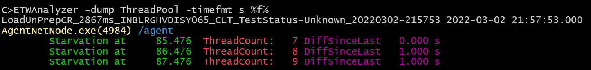

# -Dump ThreadPool

Dump occurrences of .NET ThreadPool starvation events. These are useful to determine if
an application could have become slower due to increased async/await or TPL usage. The .NET Framework will add a new 
TPL thread with a 1s delay when the ThreadPool size has reached the core count. Things have
changed with .NET 6.0 but it is still useful to see. 

To get output you need to record with the .NET ETW provider named Microsoft-Windows-DotNETRuntime with the ThreadingKeyword 0x10000.
