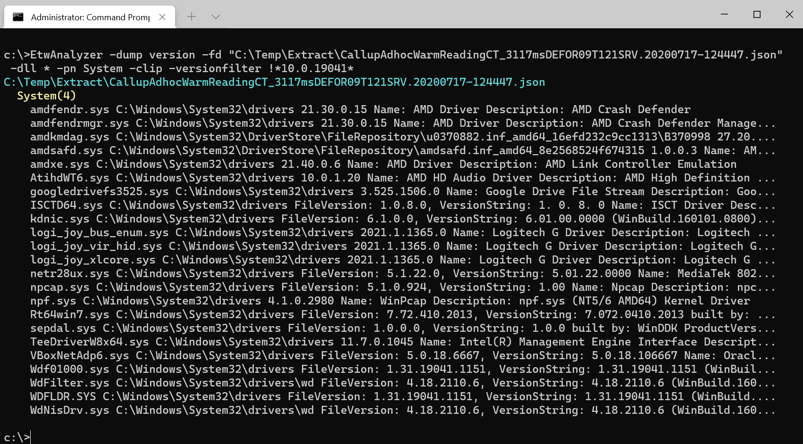

# -Dump Version

Dump file version of all loaded executables (.exe, .dll and .sys files) of all running processes. 

The concept of loaded Modules is only applicable our internal versioning scheme.

To dump all device driver versions you can use

> -dump Version -dll *.sys

That will give you a large list of all device drivers. Most interesting are non MS drivers which can cause problems. Since all
Windows drivers come with the same OS version build number you can simply exclude all drivers versioned with the Windows version number.
Then you get a list of all external or non standard device drivers: 

The *-VersionFilter* string matches everything except the file name which is covered by the *-dll* filter string.

This way you can quickly identify antivirus drivers of lesser known companies which might cause problems on that specific machine.

You can also view your own dll file versions loaded by any processes. Select with *-processname* any process from one or a 
collection of extracted ETL files to trend your build versions if an issue was introduced with a specific build. 

All commands except -dump TestRun support the *-CSV* option to write the data into a CSV file for further processing.
