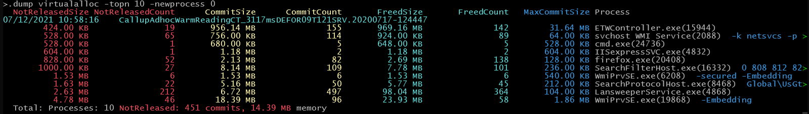
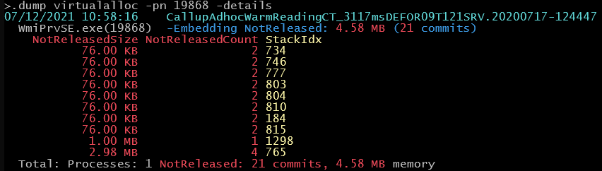
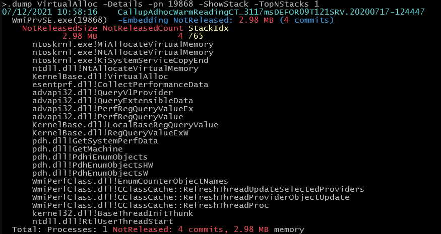
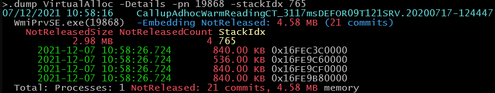

# -Dump VirtualAlloc

The VirtualAlloc Dump command can be used to identify memory leaks and understand large memory allocation patterns.
It tracks committed but not released memory per process and allocation stack, making it easy to spot allocations that were never released.
Temporary allocations that were released are included in the summary but the allocation stacks are not extracted to keep the data file size small.

VirtualAlloc is the central API to request memory from the OS in user mode.
All other allocators (C/C++ Heaps, .NET, ...) use VirtualAlloc underneath to allocate chunks of memory for their allocator.
If a larger leak shows up it is not uncommon to find the root cause with the quite coarse grained VirtualAlloc events.
If you have small leaks which build up over time you would need to resort to a different method (e.g. ETW Heap Tracing for C/C++).
The problem with the more detailed Heap tracing events is that the allocation frequency is usually so high that you are not 
able to find any leak because of the sheer amount of data. With VirtualAlloc you get a much more manageable amount of events and can easily spot the big leaks and their root cause.
For C/C++ you can try ETW Heap Snapshots (only accessible via wpr) to keep just the allocation stacks in memory and dump them from time to time, 
the slowdown is the same as with Heap Tracing but the amount of traced data is much less. The problem
with Heap Snapshots is that they do not support managed code well (at least in WPA).

The command operates in three display modes:

## Extraction

When you have recorded ETW data with the *VirtualAlloc* Kernel provider you get with ETWAnalyzer after extraction with 

```
ETWAnalyzer -extract All -fd xx.etl or 
ETWAnalyzer -extract VirtualAlloc xx.etl
```
a Json7z file containing the relevant events. This file is the input for the `-dump VirtualAlloc` command.
By default allocations for exited processes are omitted to focus on leaks and to reduce extracted data size. If you
want to include exited processes, add the `-IncludeExitedProcesses` flag during extraction:

## 1. Overview Mode (Default)

Shows a per-process summary of VirtualAlloc activity including total committed size, freed size, and unreleased (leaked) memory.

> ETWAnalyzer -fd xx.json7z -dump VirtualAlloc

This is the default view when no additional flags are specified. Use `-SortBy` to change the sort order (e.g. `CommitSize`, `FreedSize`, `NotReleasedSize`).
Use `-TopN` to limit the number of processes displayed. When using the console mode (`ETWAnalyzer -console ...json7z`) you can conveniently 
issue multiple queries without the need to load the data every time again. The query below show the top 10 allocating
processes which were running from trace start until trace end.

>.dump virtualalloc -topn 10 -newprocess 0



## 2. Details Mode (-Details)

Shows the top allocation stacks per process, grouped by call stack. Each entry shows the not-released remainder which can be the source of a memory leak.
To interpret a given stack as a memory leak you should carefully analyze the allocation stack.
If the allocation stack is a heap segment allocation (malloc, new in C++ or new in .NET, ...) the stack
can be just the victim which did trigger heap growth but the preceding allocations responsible for filling up the heap segment might 
be invisible. Treat conclusions about the leak source with a grain of salt due to the coarse grained nature of VirtualAlloc tracing.
If your own code is calling VirtualAlloc directly then you have a very good signal to locate leaks directly.

The following command selects the highest allocating process WmiPrvSE.exe(19868) to check in which stacks
most allocations are happening:

> .dump Virtualalloc -pn 19868 -details 


Use `-TopNStacks` to control how many stacks are shown per process (default: 10). Add `-ShowStack` to print the full stack trace for each group.

> .dump VirtualAlloc -Details -pn 19868 -ShowStack -TopNStacks 1


Filters available in details mode:
- `-MinMaxNotReleasedSize xx yy` — filter stacks by unreleased size (supports units like KB, MB, GB).
- `-MinMaxNotReleasedCount xx yy` — filter stacks by unreleased commit count.
- `-MinMaxAllocTime xx yy` — only include allocation events within a time window (seconds since trace start).
- `-StackFilter filter` — filter by stack trace content.

## 3. StackIdx Mode (-StackIdx)

Shows individual allocation events for specific stack indices. This is useful for drilling into a particular allocation site
identified in details mode.

To show all unreleased allocations for a given stack you need to use -stackIdx which shows all events for the given stack index. 
> .dump VirtualAlloc -Details -pn 19868 -stackIdx 765 


Each event shows its timestamp, size and allocation address. Use `-TimeFmt` and `-TimeDigits` to control the time format:

> .dump VirtualAlloc -Details -StackIdx 5 -TimeFmt local -TimeDigits 6

Use `-MinMaxAllocTime` to restrict the time range of displayed events:

> .dump VirtualAlloc -Details -StackIdx 5 -MinMaxAllocTime 10 60

## Common Options

| Flag | Description |
|------|-------------|
| `-ProcessName/pn filter` | Filter by process name |
| `-CmdLine substring` | Filter by command line content |
| `-NoCmdLine` | Suppress command line output |
| `-TopN dd` | Limit number of processes shown |
| `-TopNStacks dd` | Limit stacks per process (default: 10) |
| `-SortBy xx` | Sort order: NotReleasedSize, NotReleasedCount, CommitSize, CommitCount, FreedSize, FreedCount, MaxCommitSize |
| `-Column col1;col2` | Configure visible columns (prefix with ! to disable, + to add) |
| `-ShowTotal [Total,None]` | Control total summary display |
| `-TimeFmt` | Time format (s, Local, LocalTime, UTC, UTCTime, Here, HereTime) |
| `-TimeDigits d` | Time precision digits (0-6, default: 3) |
| `-MinMaxAllocTime xx yy` | Filter events by time in seconds since trace start |
| `-MinMaxNotReleasedSize xx yy` | Filter stacks by unreleased size |
| `-MinMaxNotReleasedCount xx yy` | Filter stacks by unreleased count |
| `-ShowStack` | Display full stack traces |
| `-StackFilter filter` | Filter by stack content |
| `-StackIdx idx1;idx2` | Show individual events for specific stack indices |

## Recording Hints
The supplied profile of ETWController https://raw.githubusercontent.com/Alois-xx/etwcontroller/refs/heads/master/ETWController/ETW/MultiProfile.wprp contains the 
VirtualAlloc profile which collects VirtualAlloc events with stack traces.

```
wpr -start MultiProfile.wprp!VirtualAlloc
```
