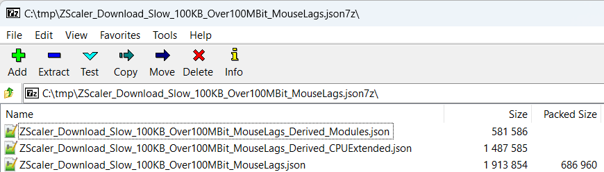
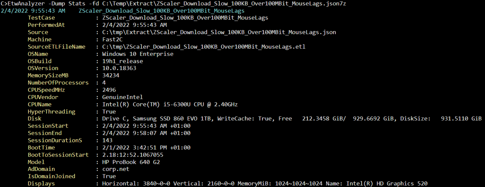
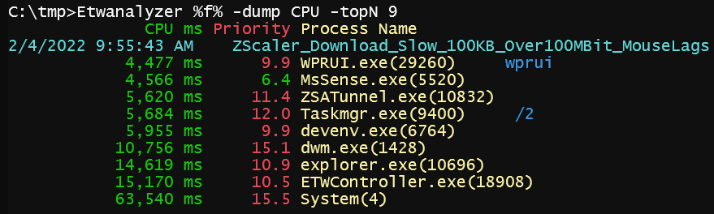

# ETWAnalyzer

## License
ETWAnalyzer main license is [MIT][ETWAnalyzerLicense].

## Open Source and 3rd Party Software
ETWAnalyzer uses Open Source and 3rd Party Software listed in [ReadMe.oss][ETWAnalyzerOSS].

## What is it? 
ETWAnalyzer extracts from ETL files summary information into Json files. The ETL files are produced by the builtin profiling infrastructure of Windows [Event Tracing for Windows (ETW)](https://docs.microsoft.com/en-us/windows/win32/etw/about-event-tracing). 
Profiling data can be collected with e.g. [wpr](https://docs.microsoft.com/en-us/windows-hardware/test/wpt/windows-performance-recorder), wprUI, xperf, PerfView, ... . Wpr is part of Windows 10 which enables you to record data on any Windows machine without additional software installation in the field. 
These recorded ETL files are usually large (multi GB) and load slow into analysis tools such as 
[Windows Performance Analyzer (WPA)](https://docs.microsoft.com/en-us/windows-hardware/test/wpt/windows-performance-analyzer#:~:text=Included%20in%20the%20Windows%20Assessment,run%20in%20the%20Assessment%20Platform.) 
or [PerfView](https://github.com/microsoft/perfview). The design goal of ETWAnalyzer is to extract from huge ETL files the smallest data set that is necessary to identify performance bottlenenecks or regression issues in 
one or a collection of thousands of ETL files. 

After extraction ETWAnalyzer has many query commands to make the data much more accessible. It can query one or many files where the output is either printed to console, 
or written to a CSV file for further analysis. 

The Json files can also be accessed via a C# interface [**IETWExtract**](ETWAnalyzer/Documentation/ProgramaticAccess.md) which enables you to write custom analyzers.

Json files are much faster to query than the input ETL files without slow symbol server lookups.
It is based on years of field experience with ETW file analysis to keep the extracted Json file size as small as possible while maximizing the insights you can get of the extracted files.
An ETW Json file is typically a few MB while the input .etl file including PDBs is hundreds of MB. 

## Contributing
You want to contribute, miss specific data, or want to add your specific dump command? Check out [Contributing](ETWAnalyzer/Documentation/Contributing.md) to get started.

## Data Generation
There is a sample .wprp profile located at [MultiProfile.wprp](https://github.com/Alois-xx/FileWriter/blob/master/MultiProfile.wprp) to record ETW data in the way ETWAnalyzer likes best. To generate data in automated regression tests see the other example project [https://github.com/Alois-xx/FileWriter](https://github.com/Alois-xx/FileWriter).

## Data Extraction
Data extraction is done for one or a directory of ETL files. Zipped ETL files are extracted. By default 75% of all cores are used.
Normally you would want to use all builtin extractors which include 

| Extractor  | What is extracted from ETL Into Json? |
| ------------- | ------------- |
| All  | Include all extractors  |
| Default  | Include all extractors except File  |
| CPU|CPU consumption of all proceses part of the recording. CPU Sampling (*PROFILE*) and/or Context Switch tracing (*CSWITCH*) data with stacks must be present. |
| Stacktag | Get from all processes the CPU call stack summary by the WPA stacktag names. Same recording settings as for CPU are needed. |
| Memory| Get workingset/committed memory machine wide and of all processes at trace start and a second time at trace end. *MEMINFO_WS* must be present. |
| Exception|Get all .NET Exception Messages, Type and their call stacks when present with Process,ThreadId and TimeStamp. The *Microsoft-Windows-DotNETRuntime* ETW provider with *ExceptionKeyword 0x8000* and stacks must be present. |
| Disk| Disk IO summary and a per file summary of read/write/flush disk service times. *DISK_IO* data must be present in trace to get this data.|
| File| Open/Close/Read/Write summary of all accessed files per process. The ETL file must contain *FILEIO* data.|
| Module| Dump all loaded modules with file path and version. *LOADER* data must be present in trace. |
| PMC      | Extract CPU cache misses, branch mispredictions. This reads low level CPU performance data. Additionally LBR (Last Branch Record) traces are processed to estimate call counts without the need to instrument any code. The ETL file must have enabled PMC tracing in counting mode or LBR (Last Branch Record) tracing. To enable see [PMC Help](https://github.com/Siemens-Healthineers/ETWAnalyzer/blob/main/ETWAnalyzer/Documentation/DumpPMCCommand.md). |

### Example

The following command extracts everything, using Microsoft symbols from a single ETL file. 

The option -AllCPU will include also methods with < 10 ms CPU or Wait time which are normally not relevant for performance regression issues to keep the file size as small as possible. 

There is extracted example data located at [Test Data](https://github.com/Siemens-Healthineers/ETWAnalyzer/blob/main/ETWAnalyzer_uTest/TestData/CallupAdhocWarmReadingCT_3117msFO9DE01T0162PC.20200717-124447.json) which you can query at your own. Can you find the performance bug?
Download the data to a directory and try
- *cd DownloadDir*
- *ETWAnalyzer -dump CPU -topN 5*
- *ETWAnalyzer -dump CPU -topN 1 -methods* *
- *ETWAnalyzer -dump CPU -topN 1 -methods* * *-sortby stackdepth -MinMaxCPUMs 1000*
- *ETWAnalyzer -dump CPU -topN 1 -methods* * *-sortby stackdepth -MinMaxCPUMs 1000 -includedll*
- *ETWAnalyzer -dump CPU -topN 1 -methods* * *-sortby stackdepth -MinMaxCPUMs 1000 -includedll -threadcount*
- *ETWAnalyzer -dump CPU -topN 1 -methods* * *-sortby stackdepth -MinMaxCPUMs 1000 -FirstLastDuration s s*
- *ETWAnalyzer -dump Stats -Properties SessionDurations*

This shows a Microsoft Bug at work while some serialization performance test was executed.

## Querying the Data
After extraction from a > 600 MB input file a small ca. 6 MB file in the output folder. 

ETWanalyzer will query all files in the current directory if you do not use -filedir/-fd xxx.  
The first query would be to check on which machine with how much memory, CPU and Windows version it was running. 

If you have a directory of files you can limit the output to specific properties with e.g. *-Properties MemorySizeMB,OSName,NumberOfProcessors,CPUSpeedMHz,CPUVendor,CPUName* to
get a quick overview of the machine specs of a bunch of extracted ETL files. 

Now we want to get an overview what the CPU consumption was of the top 9 CPU consumers of that file

The mouse was hanging while I was downloading data. At the same time the CPU was fully utilized on my quad core notebook.
The by far highest CPU consumer was the Windows Kernel which sits in the System process. Lets pick that one and print the top 30 methods.

To understand the data you need to know that ETWAnalyzer keeps for every method in a process the method inclusive times 
for CPU and Wait summed accross all threads. CPU timing is extracted from CPU sampling data. Wait times are determined from Context Switch data which signal the time a
method was moved off a CPU due to a blocking OS call. That is the reason why Main or other entry point methods for a thread have the highest CPU
consumption but are not the performance bottleneck. The actual issue is in one of the methods which consume CPU which is not directly visible
in the extracted data.
To get an overview for a new issue one turns over to WPA to see time dependencies which can only visually be analyzed.

Once the issue is understood you can create [WPA stacktags](https://docs.microsoft.com/en-us/windows-hardware/test/wpt/stack-tags) of past issues to see if the same issue 
in the other file also appears without the need to drill deep into the call stacks. In this case it is obvious that we have again a Firewall problem where each network packet 
gets an expensive check in WfpAlepReauthorizeOutboundConnection which traverses long (many firewall rules?) lists. 

Bad things keep coming back. After having identified a pattern in WPA we can check other ETW files either manually or we query the data with ETWAnalyzer and save a 
lot of time. Since WPA and ETWAnalyzer support stacktags we can dump the top 10 stacktags for the System process. 
After adding "-stacktags *" to the command line we get all stacktags. If you add "-stacktags * -methods *" all methods and stacktags are printed together in one list.

**Note: There is only one filter named -topNMethods which filters for the overall top CPU consumers for methods and stacktags.**

From the stacktag CPU consumption we find as top match "Windows\Windows Firewall" which proves that we have hit the same issue again. 

From the WPA stacktrace we know that these calls are executed as [DPCs (Deferred Procedure Calls)](https://en.wikipedia.org/wiki/Deferred_Procedure_Call) which are normally issued for longer running tasks from 
an interrupt handler. The DPCs for all network packets consume up to all 4 cores on my machine which compete with the mouse interrupt handling
resulting in a slow, sluggish system. It is time to call Microsoft Support to ask where this is coming from. To check which dll version 
we are running one would turn over to WPA and open the Images graph to find which dlls in which version are loaded. 
There you can find the exact patch level of the OS or your application dlls which are loaded by a process.

ETWAnalyzer amends version information to CPU data if you add to **-dump CPU** *-ShowModuleInfo* or *-smi*. That will show besides the method names module version data. 
If you are not using a console with a high console buffer width the output becomes unreadable due to word wrapping. To better support non wraping consoles
you can add -Clip to all commands of ETWAnalyzer to prevent wraparound of output. Besides the version we would need the dll which is by default
not printed. But you can add *-IncludeDll* or *-id* to get besides method names also the dll name. 

That small intro showed some of the key features of ETWAnalyzer. With this tool it is easy to detect patterns in thousands of ETL files which
was an impossible task with other publicly available tools. If you have performance trending tests it makes a lot of sense to run them with ETW profiling enabled 
so you can later find systematic deviations with a simple query. Issues which were before that tool 
too much work to track down are now a simple query. If your test is e.g. 3/30 times 20% slower you can query all tests for common patterns to 
see if e.g. a running Windows Installer did have an effect to your test execution time or if that did occur in other fast tests as well. 

The currently supported dump commands are
- [CPU](ETWAnalyzer/Documentation/DumpCPUCommand.md) 
- [Disk](ETWAnalyzer/Documentation/DumpDiskCommand.md) 
- [File](ETWAnalyzer/Documentation/DumpFileCommand.md) 
- [Stats](ETWAnalyzer/Documentation/StatsCommand.md)
- [Process](ETWAnalyzer/Documentation/DumpProcessCommand.md) 
- [Memory](ETWAnalyzer/Documentation/DumpMemoryCommand.md) 
- [Version](ETWAnalyzer/Documentation/DumpVersionCommand.md)
- [Exception](ETWAnalyzer/Documentation/DumpExceptionCommand.md)
- [ThreadPool](ETWAnalyzer/Documentation/DumpThreadPoolCommand.md) 
- [Mark](ETWAnalyzer/Documentation/DumpMarkCommand.md)
- [TestRun](ETWAnalyzer/Documentation/DumpTestRunCommand.md)
- [PMC](ETWAnalyzer/Documentation/DumpPMCCommand.md)
- [LBR](ETWAnalyzer/Documentation/DumpLBRCommand.md)

which all support -filedir and an extensive command line help what you can dump from the extracted data. 

<!-- References -->
[ETWAnalyzerLicense]:                                       <LICENSE>
[ETWAnalyzerOSS]:                                           <ETWAnalyzer/3rdParty/ReadMeOSS.md>
